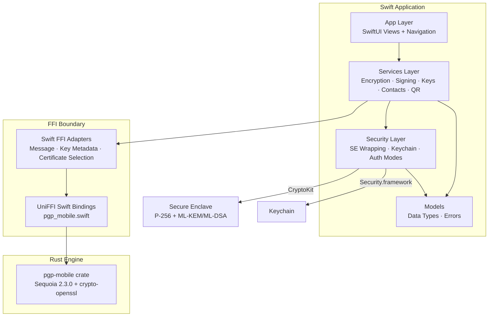
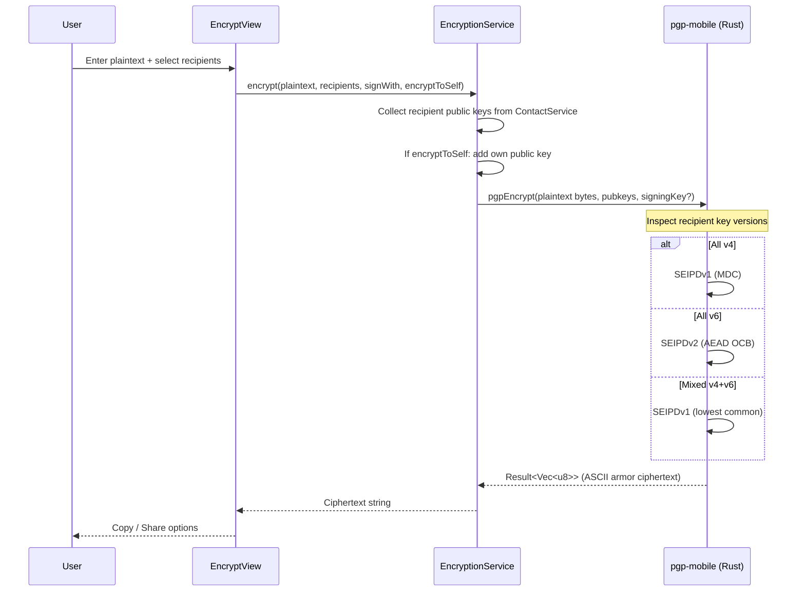
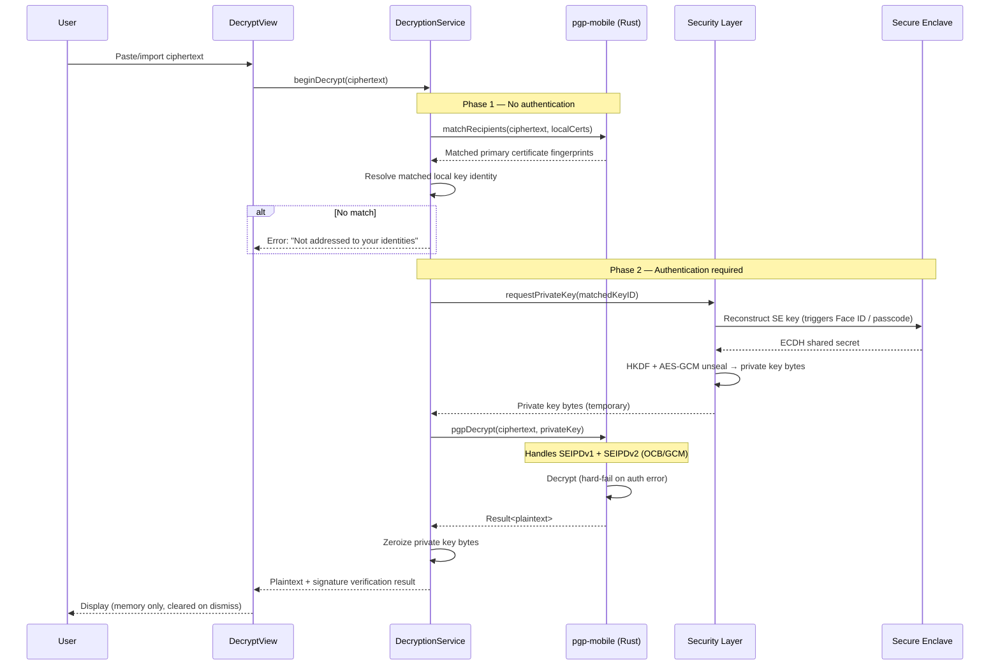
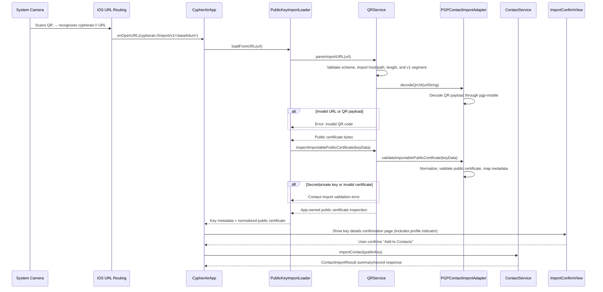
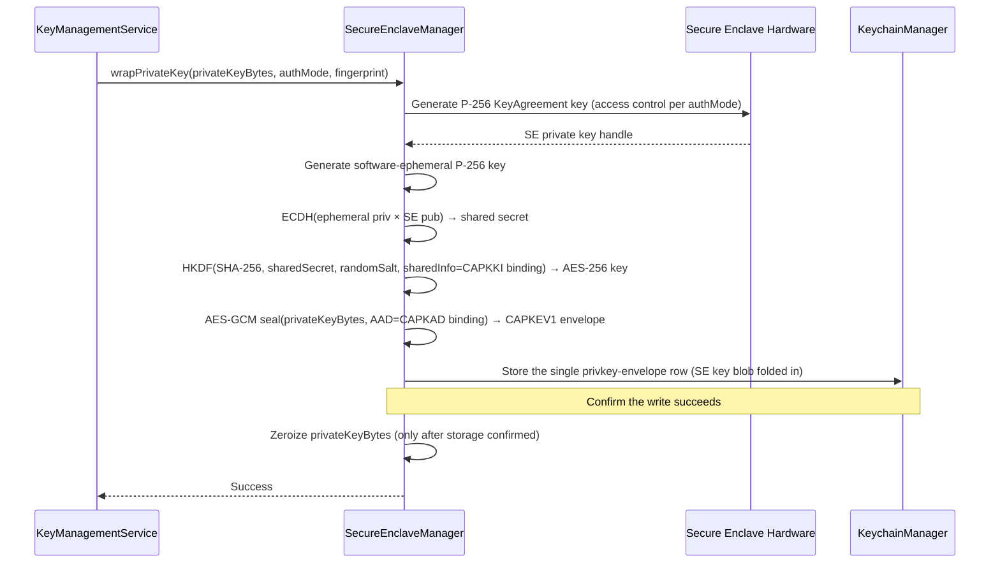
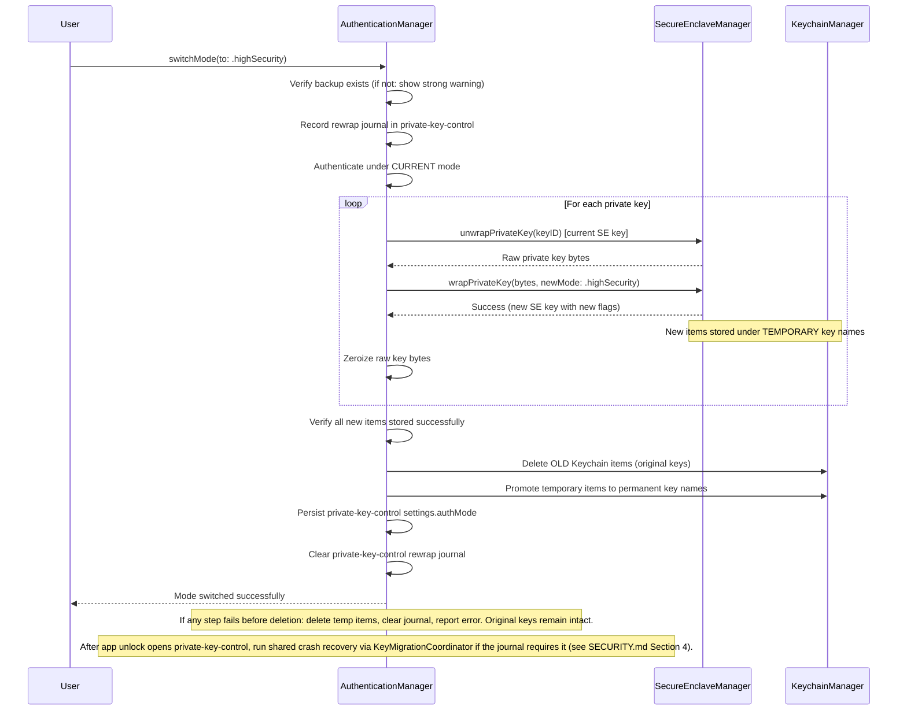

# Architecture

> Status: Canonical current-state.
> Purpose: Module breakdown, dependency relationships, and data flow for CypherAir.
> Audience: Human developers and AI coding tools.
> Update triggers: Module ownership, FFI capability families, data flows, tightly-coupled pairs, or storage layout change.
> Last reviewed: 2026-06-12.

## 1. Layer Overview

CypherAir is a layered application: a SwiftUI presentation layer, a Swift
services layer, a Security layer, app-owned Models, and a Rust cryptographic
engine reached through Swift FFI adapters and generated UniFFI bindings.



## 2. Module Breakdown

### App Layer (`Sources/App/`)

SwiftUI views, navigation routing, onboarding, and application composition. Views remain thin and call into the Services layer for all operations. Uses iOS 26 Liquid Glass conventions where applicable and native platform SwiftUI chrome elsewhere. Standard components auto-adopt; custom floating controls apply `.glassEffect()` only where the API is available and platform-appropriate.

Key files:

- `CypherAirApp.swift` — app entry point, scene wiring, environment injection, and presentation modifiers
- `AppLaunchConfiguration.swift` — launch and UI-test environment parsing
- `AppLoadWarningCoordinator.swift` — load-warning pending/presentation gate state
- `AppContainer.swift` — centralized dependency construction with shared graph helpers for common default/UI-test wiring
- `AppStartupCoordinator.swift` — synchronous pre-auth bootstrap, cold-start loading, crash recovery, temporary file cleanup, startup warning aggregation
- `LocalDataResetService.swift` — destructive reset workflow for CypherAir-owned Keychain items, ProtectedData files, contacts, defaults, temporary files, and in-memory session state
- `LocalDataResetRestartAction.swift` — platform restart/termination action after local-data reset
- `AppSceneIncomingURLRouter.swift` — scene-level URL handoff into the incoming contact-import coordinator
- `ProtectedSettingsAccessCoordinator.swift` — protected-settings access, domain creation, open-domain, reset, retry, and clipboard-notice mutation authorization workflow policy
- `ProtectedSettingsHost.swift` — SwiftUI-facing protected-settings host, section-state projection, environment injection, and presentation trace metadata
- `ContentView.swift` — root navigation
- `OnboardingView.swift` — first-run flow and guided tutorial decision page
- `Onboarding/Tutorial*` — sandboxed guided tutorial host, session store, shell, and page-configuration seams

### App Common Helpers (`Sources/App/Common/`)

Shared presentation-layer infrastructure used across multiple views.

| Helper | Responsibility |
|--------|---------------|
| `OperationController` | Shared task lifecycle, cancellation, progress state, error presentation, and clipboard notice handling for encrypt/decrypt/sign/verify flows |
| `SecurityScopedFileAccess` | Uniform wrapper around security-scoped file URL access |
| `FileExportController` | Shared `fileExporter` state for exporting generated data or existing files |
| `CosmeticPrivacyCover` | Pure content-obscuring overlay shown whenever the app is not foreground-active; zero coupling to authentication (cover ≠ lock) |
| `AppLockSurfaceView` | Opaque lock surface (app name + locked-state caption; all platforms) driven by `AppLockController.lockState`; auto-invokes system authentication on appear and hosts retry / biometrics-locked-out messaging |
| `AppLifecycleObserver` | Routes platform lifecycle signals (ScenePhase / app-resign / screen-lock) into `AppLockController` foreground-active and away events |

### Services Layer (`Sources/Services/`)

Orchestrates user-facing operations by coordinating the Security layer, app-owned
models, and FFI adapters. Message encryption/decryption, password-message,
key-generation/import/export/expiry, QR, contact-import, and self-test operations
call dedicated FFI adapters rather than `PgpEngine` directly.

| Service | Responsibility |
|---------|---------------|
| `EncryptionService` | Text/file encryption with recipient selection, encrypt-to-self, signature toggle, **auto format selection** (SEIPDv1/v2 by recipient key version) through the message FFI adapter. Text and streaming file optional signing delegate to private-key encryption helpers so software custody keeps the existing unwrap/zeroize path while Secure Enclave signer routes use the external signer runtime APIs. |
| `DecryptionService` | Two-phase decryption: header parse (Phase 1, no auth) → decrypt (Phase 2, auth required). In Phase 2, both recipient-key message decrypt and streaming file decrypt delegate custody dispatch to router-owned helpers (`PrivateKeyMessageDecryptionService` / `PrivateKeyStreamingFileDecryptionService`): software custody unwraps and zeroizes the secret certificate, while a Secure Enclave key-agreement route loads only the `.keyAgreement` handle. Generated decrypt calls and result mapping live behind the message FFI adapter. Handles both SEIPDv1 and SEIPDv2. **Security-critical: Phase 1/Phase 2 boundary must never be bypassed.** |
| `PasswordMessageService` | Password/SKESK message encryption and decryption with optional signing through an app-owned password-message format and the message FFI adapter. Optional password-message signing delegates to a private-key password-message helper so software custody keeps the existing unwrap/zeroize path while Secure Enclave signer routes use the external signer runtime API. Password-based decrypt remains separate from the recipient-key/two-phase decrypt flow and does not use PKESK matching. |
| `SigningService` | Cleartext text signatures, detached file signatures, and detailed signature-result service APIs used by current verify workflows. Cleartext and detached file signing route through private-operation helpers so software custody preserves the existing unwrap/zeroize path while Secure Enclave signer routes use the external signer runtime API. |
| `KeyManagementService` | Key generation (**family-aware**: Portable Compatible/Profile A → Cv25519/RFC4880, Portable Modern/Profile B → Cv448/RFC9580, Device-Bound Compatible/Modern → Secure Enclave custody P-256 v4/v6), import, export, expiry modification, revocation export, selector discovery, selective revocation export, and Secure Enclave custody generation (production-wired since P7D, hardware-guarded, prompt-session enrolled) through focused internal key-management helpers and key/certificate FFI adapters |
| `PGPKeyCapabilityResolver` | Pure policy resolver for app-owned OpenPGP configuration, private-key custody, operation-support vocabulary, and sanitized failure-category resolution. Software-key operations are supported; since P7D the production policy also supports Secure Enclave generation, signing-class, and key-agreement operations (refreshBinding stays explicitly not-implemented; private-material export stays hard-unsupported independent of policy). Narrow test policies remain for route-isolation tests. |
| `PrivateKeyOperationRouter` | Internal key-management router for private-operation requests. It returns software secret-certificate routes without unwrapping, Secure Enclave signer/key-agreement routes after public-binding and handle checks, or blocked `PGPKeyOperationResolution` values. Signing-class operations (cleartext signing; text/password/file sign-plus-encrypt; detached file signing; modify-expiry; selective subkey/User ID revocation export; User ID contact certification) and recipient-key message and streaming file decrypt dispatch through router-owned private-key helpers; direct-key certification, key-level revocation-artifact generation, and standalone binding refresh remain deferred. |
| `CertificateSignatureService` | Certificate-signature verification and User ID certification generation. Owns target User ID selector validation, generated artifact validation, and signer identity resolution at the service boundary, while private signing dispatch delegates to a route-aware contact-certification helper. |
| `ContactService` | App/UI-facing Contacts facade for availability, person-centered public-key import/update through the contact-import FFI adapter, verification state, search/tags, key-record lookup APIs, protected-domain runtime projection, mutation rollback, and relock cleanup |
| `QRService` | QR generation (CIQRCodeGenerator), QR decoding from photo (CIDetector), URL scheme parsing through the contact-import FFI adapter. **Security-critical: parses untrusted external input.** |
| `SelfTestService` | One-tap diagnostic covering **both profiles** through message and self-test FFI adapters: key gen → encrypt/decrypt → sign/verify → tamper test → QR round-trip |
| `FileProgressReporter` | Observable progress/cancellation state for streaming operations. Message encrypt/decrypt/sign/verify calls use an FFI-owned bridge to connect it to UniFFI progress callbacks. Thread-safe via `OSAllocatedUnfairLock`. |
| `DiskSpaceChecker` | Runtime disk space validation before streaming file encryption. Uses `volumeAvailableCapacityForImportantUsageKey` to prevent Jetsam termination during large file operations. |

### Guided Tutorial Architecture (`Sources/App/Onboarding/`)

The guided tutorial is a host-driven sandbox that teaches the real app workflow without touching real workspace state. `TutorialView` owns the hub, sandbox acknowledgement, workspace, completion, and leave-confirmation surfaces. `TutorialSessionStore` owns the current tutorial session, seven-module progress, replay unlock rules, navigation state, active tutorial modal, output interception policy, and completion-version persistence.

`TutorialSandboxContainer` builds a separate dependency graph for the tutorial using the fixed `com.cypherair.tutorial.sandbox` `UserDefaults` suite, a temporary contacts directory with verified complete file protection, real app services, and mock Secure Enclave / Keychain primitives behind a real `AuthenticationManager`. The product flow owns a single active tutorial sandbox at a time; creating the container first clears the fixed suite. Current tutorial cleanup removes the fixed suite and directory, and startup/reset cleanup removes the fixed suite plist and tutorial temp directories. The tutorial reuses production pages through `TutorialConfigurationFactory`, `TutorialRouteDestinationView`, and `TutorialShellDefinitionsBuilder`; tutorial behavior is injected through generic page configuration instead of pervasive page-level tutorial branches.

The tutorial's mock security primitives are temporary SR-FIX-18 debt, not production security primitives — the naming and containment rules live in the Security Layer table below and [SECURITY.md](SECURITY.md) Section 6. The long-term direction is to move the tutorial to tutorial-specific isolated Protected Data domains and real hardware-backed processing that never touches user security assets.

Safety is enforced by narrow host boundaries:

- `TutorialUnsafeRouteBlocklist` blocks only routes that would break isolation or create misleading tutorial behavior.
- `OutputInterceptionPolicy` suppresses clipboard writes and real file/data exports during a live tutorial session.
- Page configuration disables real file import/export, share/copy sinks, onboarding re-entry, app icon changes, selective revocation export, and certificate-signature workflows inside the sandbox while preserving the real page structure where practical.
- Tutorial helper modals keep shell guidance hidden while active, but the tutorial host wraps import, auth-mode, and leave-confirmation modals with module-aware sandbox guidance so the task context does not disappear during an interruption.
- `TutorialAutomationContract` owns tutorial-ready markers and stable UI identifiers for onboarding decision actions, tutorial hub/completion actions, return/close/finish controls, helper modals, and completion prompts.

### Current Rust / FFI Capability Ownership

| Family | Swift service owner | Current app owner | Status |
|--------|---------------------|-------------------|--------|
| Certificate Merge / Update | `ContactService` | `AddContactScreenModel`, `ContactImportWorkflow`, `ImportConfirmationCoordinator`, `IncomingURLImportCoordinator`, URL import handoff in `CypherAirApp` | Shipped |
| Contact QR Encode / Decode | `QRService` | `QRDisplayScreenModel`, `AddContactScreenModel` through `PublicKeyImportLoader`, `IncomingURLImportCoordinator` | Shipped |
| Revocation Construction | `KeyManagementService` | `KeyDetailScreenModel`, `SelectiveRevocationScreenModel` | Shipped |
| Password / SKESK Symmetric Messages | `PasswordMessageService` | None | Service-only |
| Certification And Binding Verification | `CertificateSignatureService` | `ContactDetailScreenModel`, `ContactCertificateSignaturesScreenModel`, `ContactCertificationDetailsScreenModel` | Shipped |
| Richer Signature Results | `SigningService` and `DecryptionService` | `VerifyScreenModel`, `DecryptScreenModel`, shared `DetailedSignatureSectionView` | Shipped |

Current app-surface workflows call the owning Swift service rather than `PgpEngine`
directly. Key-management helpers avoid direct engine ownership through
`PGPKeyOperationAdapter` and `PGPCertificateOperationAdapter`.
Encrypt/decrypt/password-message services use `PGPMessageOperationAdapter`,
QR/contact import use `PGPContactImportAdapter`, and the diagnostic runner uses
`PGPSelfTestOperationAdapter`. These adapters contain generated operation calls,
generated-error normalization, progress bridging where applicable, and generated
result mapping. `PasswordMessageService` remains intentionally service-only until
product scope adds a dedicated route and plaintext-handling contract.

### Apple Secure Enclave Custody Boundary

The software-custody Security layer uses Secure Enclave as a device-bound wrapper
around complete OpenPGP secret certificate bytes. Apple Secure Enclave Custody is
an implemented, production-exposed boundary (since issue #501 Phase 7D): Secure
Enclave owns distinct P-256 signing and key-agreement private-key operations
directly, while software keeps owning OpenPGP packet construction, KDF / AES Key
Wrap processing, session-key handling, payload decryption, and signature
verification. Key metadata models algorithm/profile and private-key custody as
separate app-owned dimensions, with a capability resolver exposing only supported
combinations.
Sequoia 2.3's `Signer` and `Decryptor` traits are the Rust-side seam for this
external private-key custody model. The full custody reference (model, contract,
operation surface, evidence) lives in
[SECURE_ENCLAVE_CUSTODY](SECURE_ENCLAVE_CUSTODY.md).

The boundary keeps fixed ownership across three layers, gated by the
capability resolver (production-exposed since P7D; Phase 9 release gate satisfied).

- **Rust/OpenPGP seam.** A narrow callback delegates only the private scalar
  operation through the Sequoia `Signer`/`Decryptor` traits: signing receives a
  public key plus SHA-256 digest and returns an ECDSA `r/s` that Rust verifies
  against that key and digest; key agreement receives the recipient and ephemeral
  P-256 public keys and returns a raw 32-byte shared secret. Rust/Sequoia retains
  OpenPGP packet construction, ECDH KDF, AES Key Wrap, session-key validation,
  payload authentication, verification folding, and public-only
  certificate/revocation construction and inspection. The seam reaches Swift only
  through the runtime UniFFI APIs and their FFI provider bridges and
  never accepts or returns secret certificate material.

- **Security-layer custody store.** `SecureEnclaveCustodyHandleStore` owns the two
  role-separated P-256 handles, public-binding/role checks, rollback, inventory,
  lookup, idempotent delete, local-reset cleanup, and sanitized failure mapping;
  `SecureEnclaveCustodyKeyAgreement` is the ECDH bridge and
  `SecureEnclaveCustodyGenerationRecoveryService` the metadata/handle recovery
  classifier (see the Security Layer table). Access-control flags, application-tag
  format, and the non-disclosure rules are security red lines owned by
  [SECURITY.md](SECURITY.md) §3.

- **Router dispatch.** `PGPKeyCapabilityResolver` gates generation, signing-class,
  and key-agreement operations independently, and `PrivateKeyOperationRouter`
  selects a route only after public-binding checks (see the Services Layer table).
  Workflow services delegate custody dispatch to router-owned private-key helpers
  instead of switching on custody themselves, and a Secure Enclave route never
  falls back to software secret-certificate material.

Software custody is unchanged on every path: it unwraps and zeroizes the complete
secret certificate as before. Product UI and production availability are live since
Phase 7D (capability-resolver-gated).

### Security Layer (`Sources/Security/`)

Manages all hardware-backed security operations. This is the most sensitive module.

| Component | Responsibility |
|-----------|---------------|
| `SecureEnclaveManager` | P-256 key generation in SE, ephemeral-static ECDH + HKDF + AES-GCM (AAD-bound) `CAPKEV1` envelope wrapping/unwrapping, key deletion. Same wrapping scheme for Ed25519/X25519/Ed448/X448. |
| `KeychainManager` | CRUD for Keychain items (private-key envelope rows and ProtectedData support rows), access control flag configuration |
| `AuthenticationManager` | Standard/High Security mode logic, mode switching with SE key re-wrapping, LAContext evaluation, and post-unlock auth-mode crash recovery |
| `PrivateKeyModeSwitchAuthenticator` | Current-mode authentication gate for private-key mode switching before any rewrap journal or Keychain mutation |
| `PrivateKeyRewrapWorkflow` | Phase-A and phase-B private-key rewrap workflow: pending envelope-row creation/verification, commit-required marking, permanent deletion, pending promotion, cleanup, and final auth-mode commit |
| `PrivateKeyRewrapRecoveryCoordinator` | Phase-aware interrupted private-key rewrap recovery using permanent/pending Keychain envelope-row state and protected `private-key-control` journal state |
| `ProtectedDataSessionCoordinator` | ProtectedData session state owner for authenticated root-secret access, wrapping-root-key derivation, relock, secret clearing, and `restartRequired` latching for protected app-data domains |
| `Sources/Security/Mocks/` | Temporary SR-FIX-18 tutorial/UI-test mock boundary. Mock implementations kept here must remain visibly named `Mock*`; production ProtectedData files must not embed mock implementations. |
| `ProtectedDomainKeyManager` | Per-domain DMK wrapping/unwrapping, Keychain-backed staged/committed wrapped-DMK record storage, and unlocked-domain-key zeroization |
| `PrivateKeyControlStore` | ProtectedData `private-key-control` domain for `authMode` and private-key rewrap / modify-expiry recovery journal state. Private-key material remains in the existing Keychain / Secure Enclave domain. |
| ProtectedData device-binding layer | Secure Enclave device-bound root-secret envelope layer. It adds a silent P-256 SE factor under the existing Keychain / `LAContext` app-data gate and does not replace app privacy authentication. |
| `SecureEnclaveCustodyHandleStore` | Custody handle lifecycle boundary for two distinct Secure Enclave P-256 `SecKey` private-operation rows, with role/public-key binding, rollback, inventory, public-binding lookup, signing/key-agreement handle lookup from public bindings, local-reset cleanup, idempotent delete, remaining-handle validation, and sanitized failure-category mapping. Consumed only by the custody generation service and the router-owned signer/key-agreement helpers. |
| `SecureEnclaveCustodyKeyAgreement` | Security bridge for the external P-256 key-agreement (ECDH) route. It validates loaded `.keyAgreement` handles, recipient public-key binding, P-256 ephemeral public-key shape, and `SecKeyCopyKeyExchangeResult` failures, returning only the raw shared secret to the Rust external key-agreement provider bridge. |
| `SecureEnclaveCustodyGenerationRecoveryService` | Custody recovery classifier that compares `PGPKeyIdentity` P-256 Secure Enclave metadata and public certificate bindings with Security handle inventory, producing only sanitized in-memory availability categories consumed at key load and by the key-detail degraded-availability row. |
| `AppSessionOrchestrator` | App-wide grace-window ownership, content-clear generation, launch/resume privacy-auth sequencing, bootstrap handoff, and protected-data access-gate evaluation |
| `AuthLifecycleTraceStore` / `AuthTraceMetadata` | Passive authentication, Keychain, Secure Enclave, ProtectedData, startup, UI timing, and local reset trace metadata; never records plaintext, keys, salts, sealed payloads, or fingerprints |
| `KeyBundleStore` | Shared storage helper for single-row private-key envelopes (permanent/pending namespaces, rollback, replace-from-pending semantics) |
| `KeyMetadataDomainStore` | ProtectedData `key-metadata` schema v2 domain for `PGPKeyIdentity` payloads opened after app privacy authentication |
| `KeyMigrationCoordinator` | Shared migration state machine for pending/permanent recovery, including safe/retryable/unrecoverable outcomes |
| `Argon2idMemoryGuard` | Validates `os_proc_available_memory()` against Argon2id S2K memory requirements before key import. 75% threshold prevents Jetsam termination. No-op for Profile A (Iterated+Salted S2K). |
| `MemoryZeroingUtility` | Extensions on `Data` and `Array<UInt8>` for secure clearing |

### ProtectedData Current Additions (`Sources/Security/ProtectedData/`)

- `ProtectedDataStorageRoot.swift` — resolves the protected app-data storage root, applies file protection, and owns registry/domain metadata paths
- `ProtectedDataRegistry.swift` / `ProtectedDataRegistryStore.swift` — registry manifest, consistency validation, recovery classification, empty-registry bootstrap, and bootstrap outcome construction
- `ProtectedDataRootSecretCoordinator.swift` — root-secret save/load/reprotect/delete orchestration and root-secret operation tracing
- `ProtectedDataDeviceBinding.swift` — ProtectedData-only Secure Enclave P-256 device-binding key (folded into the root-secret envelope for single-row reconstruction; no separate row) plus mockable provider
- `ProtectedDataRootSecretEnvelope.swift` — binary-plist `CAPDSEV3` codec that folds the device-binding SE key `dataRepresentation` for single-row reconstruction, HKDF/AAD binding data, and AES-GCM open/seal validation
- `KeychainProtectedDataRootSecretStore.swift` — Keychain-backed root-secret store for the `CAPDSEV3` envelope
- `ProtectedDomainKeyManager.swift` — derives wrapping/domain keys, wraps and unwraps per-domain DMKs via the self-describing `CADMKV2` wrapped-DMK codec, stores those envelopes in Keychain staged/committed rows, and clears unlocked DMKs on relock
- `ProtectedDomainBootstrapStore.swift` — file-side bootstrap metadata persistence
- `ProtectedDomainRecoveryCoordinator` / `ProtectedDomainRecoveryHandler` — generic pending-mutation recovery dispatch by `ProtectedDataDomainID`
- `ProtectedDataPostUnlockCoordinator` — post-app-auth protected-domain opener registry; production registers `private-key-control`, `key-metadata`, `protected-settings`, and `protected-framework-sentinel`, and may run a domain's noninteractive `ensureCommittedIfNeeded` hook inside the same handoff
- `ProtectedDataFrameworkSentinelStore.swift` — framework-owned second production domain (`protected-framework-sentinel`) with a minimal schema/purpose payload used to prove multi-domain lifecycle, recovery, and relock behavior before later product-domain migrations
- `PrivateKeyControlStore.swift` — protected domain `private-key-control` for `settings.authMode` plus `recoveryJournal`; opens through post-unlock orchestration
- `KeyMetadataDomainStore.swift` — protected domain `key-metadata`; stores schema v2 `PGPKeyIdentity` metadata including explicit OpenPGP configuration identity and private-key custody kind, and participates in relock/recovery. It does not store Apple handle locators, access-control policy, or private material.

ProtectedData component ownership:

- the framework exists and is wired into startup/bootstrap and app-session ownership
- `PrivateKeyControlStore` is the private-key control source of truth; the payload scope is `authMode`, rewrap recovery, and modify-expiry recovery
- `KeyMetadataDomainStore` is the key metadata source of truth; it is recoverable after unlock but must not be silently rebuilt from private-key envelope rows
- `ProtectedSettingsStore` is the first protected-domain adopter; schema v2 preserves `clipboardNotice` and owns the ordinary-settings snapshot for grace period, onboarding completion, encrypt-to-self, and guided tutorial completion
- `ProtectedSettingsOrdinarySettingsPersistence` adapts `ProtectedSettingsStore` to the ordinary-settings persistence protocol inside the ProtectedData boundary
- `ProtectedOrdinarySettingsCoordinator` is the source of truth for ordinary-settings availability and loaded snapshots; production reads/writes only after app privacy authentication has been reduced to app-level ordinary-settings availability
- `ProtectedDataFrameworkSentinelStore` is the second production domain; it contains no user data, telemetry, or UI state, and is created only after another domain is already committed and the shared resource is ready
- `ContactService` is the only app/UI-facing Contacts facade. It owns Contacts availability, query APIs, mutation APIs, search/tag behavior, rollback behavior, verification state, protected-domain opening, and relock cleanup.
- Normal Contacts import call sites use `ContactService.importContact(...)` and receive `ContactImportResult` values built from `ContactIdentitySummary`, `ContactKeySummary`, and optional `ContactCandidateMatch` data. Related different-fingerprint imports use candidate/merge behavior; the legacy same-user-ID key-replacement confirmation path has been removed from the app-facing runtime.
- Services that need contact public keys use `ContactKeyRecord` lookups or `ContactsVerificationContext` from `ContactService` rather than consuming flat `Contact` values. Signature/decryption/password-message verification and certificate-signature signer resolution use key records so historical signer keys can participate without exposing a flat Contacts projection.
- `ContactsDomainStore` is the Contacts protected-domain persistence owner; it opens the protected `contacts` domain post-auth and keeps `ContactService` as the app/UI facade. First protected-domain creation starts from `ContactsDomainSnapshot.empty()` and creates `contacts.sqlite`.
- `ContactsSQLCipherDatabase` owns Contacts protected-domain SQLCipher persistence at `Application Support/ProtectedData/contacts/contacts.sqlite`. It keys SQLCipher with the existing `contacts` domain master key through raw-key syntax, validates SQLCipher compile/runtime state plus `application_id`, `user_version`, and integrity, hydrates the in-memory `ContactsDomainSnapshot`, and rewrites relational tables transactionally on snapshot replacement.
- `AppContainer` assembles the Contacts store, relock participants, and post-unlock call sites only; Contacts availability and mutation policy stay inside `ContactService`.
- root-secret Keychain payloads use the single self-contained v3 Secure Enclave device-bound envelope (device-binding key folded in) while preserving the existing app-session authentication gate
- per-domain wrapped-DMK records use app-owned Keychain rows named under `com.cypherair.v1.protected-data.domain-key.*` and are self-describing `CADMKV2` envelopes; protected domain files no longer contain active wrapped-DMK records
- root-secret payloads that do not decode as a current `CAPDSEV3` envelope fail closed as ordinary undecodable input
- cold-start bootstrap results are only an initial handoff; future protected access re-checks current registry/framework state through an explicit gate
- app privacy unlock now runs a post-unlock opener pass that reuses the authenticated `LAContext` to open all eligible registered committed domains without a second prompt, including `private-key-control` and `key-metadata`; Contacts then joins the authorized session through its dedicated post-auth open path
- ProtectedData current-state coverage includes ordinary-settings, self-test export-only state, temporary/export/tutorial artifact hardening, and Contacts protected-domain state; Contacts uses the protected `contacts` domain for person-centered Contacts data and no longer reads legacy flat Contacts files
- Settings refresh can still auto-open protected settings only by consuming an existing app-session `LAContext` handoff; the handoff-only path must not start a new interactive authentication prompt
- Contacts security/storage lifecycle is current: post-auth gating, SQLCipher-backed protected-domain persistence, recovery states, and relock cleanup are implemented. Search, tags, and organization workflows run over the unlocked protected `contacts` snapshot; Encrypt uses tags only as batch actions that add currently encryptable contacts to the explicit runtime recipient selection. Contacts package exchange is not active, and complete encrypted backup is deferred to a separate mandatory encrypted design.

The canonical row-level persisted-state classification, current status, and migration-readiness table lives in [PERSISTED_STATE_INVENTORY](PERSISTED_STATE_INVENTORY.md). This architecture section names component owners and data-flow responsibilities rather than duplicating that inventory.

### Models (`Sources/Models/`)

Shared app-owned models and small coordinators for app-wide domain and persistence state. Includes Swift representations of PGP keys, app-owned error enums, configuration types, ordinary-settings snapshot/persistence coordination, app-owned Contacts validation and availability values, and stable identity parsing/formatting helpers. SwiftUI colors, icons, and localized display text live in App-layer presentation helpers. Generated `PgpError` normalization lives in the FFI mapper boundary rather than Models, and ProtectedData / Security implementation state is reduced to app-owned validation or availability values before reaching Models.

| Helper | Responsibility |
|--------|---------------|
| `IdentityPresentation` | Shared fingerprint formatting, short key ID derivation, stable user ID display-name parsing, email extraction, and accessibility label generation |

### Rust Engine (`pgp-mobile/`)

The `pgp-mobile` Rust crate wraps `sequoia-openpgp` behind a UniFFI-annotated API. It exposes operations (generate, encrypt, decrypt, sign, verify, export, import) that accept/return `Vec<u8>` and `String`. All Sequoia internal types stay hidden behind this boundary.

```
pgp-mobile/
├── Cargo.toml        # sequoia-openpgp 2.3 + crypto-openssl + uniffi
├── src/
│   ├── lib.rs        # UniFFI proc-macros, public API surface
│   ├── keys.rs       # Key module root: UniFFI records, shared helpers, internal re-exports
│   ├── keys/
│   │   ├── generation.rs          # Profile-aware generation (Cv25519/RFC4880 vs Cv448/RFC9580)
│   │   ├── secure_enclave_generation/ # SE custody public-only generation (mod.rs, tests.rs)
│   │   ├── key_info.rs            # KeyInfo parsing and display metadata
│   │   ├── selector_discovery.rs  # Subkey/User ID selector discovery
│   │   ├── public_certificates.rs # Public certificate validation and merge/update
│   │   ├── secret_transfer.rs     # Secret key export/import/extract and S2K encryption
│   │   ├── revocation.rs          # Key, subkey, User ID, and revocation certificate handling
│   │   ├── profile.rs             # Key version and profile detection
│   │   ├── s2k.rs                 # Passphrase-protected secret-key S2K inspection
│   │   └── expiry.rs              # Secret certificate expiry mutation
│   ├── encrypt.rs    # Auto format selection by recipient key version
│   ├── decrypt.rs    # SEIPDv1 + SEIPDv2 (OCB/GCM), AEAD hard-fail
│   ├── password.rs   # Password / SKESK message encrypt/decrypt
│   ├── qr_url.rs     # QR URL scheme encode/decode validation
│   ├── sign.rs       # Cleartext signing and shared signer helpers
│   ├── verify.rs     # Cleartext verification helpers with graded results
│   ├── cert_signature.rs      # Certificate-signature verification + User ID certification generation
│   ├── signature_details.rs   # Detailed signature-result records for verify/decrypt APIs
│   ├── external_signer.rs     # External P-256 signer seam (external_signer/: core, error, provider, tests)
│   ├── external_decryptor.rs  # External P-256 key-agreement decrypt seam (external_decryptor/: core, tests)
│   ├── streaming.rs  # File-path-based streaming I/O with progress reporting and cancellation
│   ├── armor.rs      # ASCII armor encode/decode
│   └── error.rs      # PgpError enum (maps 1:1 to Swift throwing functions)
├── tests/            # Rust-side unit + integration tests
└── uniffi-bindgen.rs # UniFFI CLI entrypoint used by the build script
bindings/
├── module.modulemap  # Xcode-imported module map alias
├── pgp_mobileFFI.h   # Generated C header
└── pgp_mobile.swift  # Generated Swift bindings synced into Sources/PgpMobile/
```

## 3. Data Flows

### Encrypt (Profile-Aware)



### Two-Phase Decrypt



### URL Scheme Public Key Import



### SE Key Wrapping



The wrapping scheme is identical for all key algorithms — the SE wraps raw private key bytes regardless of whether they are Ed25519, X25519, Ed448, or X448.

### Auth Mode Switching



### Protected App Data Unlock


Pre-auth startup may classify `ProtectedDataRegistry` and bootstrap metadata only. It must not read the root secret, unwrap a domain master key, or open protected payloads. Post-unlock orchestration currently opens `private-key-control`, `key-metadata`, `protected-settings`, and the framework sentinel when their registry state allows it. The protected-settings opener first ensures the domain is committed. After that handoff, App composition reduces the protected-settings domain state to app-level ordinary-settings availability; `ProtectedOrdinarySettingsCoordinator` loads the ordinary-settings snapshot only when that availability is `.available`. Locked, recovery, pending mutation, or framework-unavailable states fail closed to ordinary-settings recovery. If the registry reports pending mutation or framework recovery, domain open is blocked until recovery completes.

## 4. Tightly Coupled Modules

These pairs must be updated together. A change to one without the other will cause build failures or runtime errors.

| Module A | Module B | Coupling Reason |
|----------|----------|----------------|
| `pgp-mobile/src/error.rs` | `Sources/Services/FFI/PGPErrorMapper.swift` and `Sources/Models/CypherAirError.swift` | Generated `PgpError` variants are normalized only at the FFI mapper boundary into the app-owned `CypherAirError` vocabulary; `CypherAirError.from` preserves already-normalized app errors and applies caller fallbacks |
| `pgp-mobile/src/keys.rs` external callbacks | `pgp-mobile/src/external_signer.rs` and `Sources/Services/FFI/*` callback bridges | Foreign private-operation callbacks use dedicated generated callback error types and sanitized categories; callback failures must not be carried through Sequoia as free-form strings |
| `pgp-mobile/src/lib.rs` (public API) | `Sources/Services/FFI/*Adapter.swift` and explicitly documented temporary call sites | Any Rust API change requires Swift adapter or documented temporary call-site updates |
| `SecureEnclaveManager` | `KeychainManager` | SE wrapping writes the single `privkey-envelope` row; unwrapping reads it |
| `SecureEnclaveManager` | `AuthenticationManager` | Mode switch re-wraps all keys via SE manager |
| `DecryptionService` | `AuthenticationManager` | Phase 2 auth policy depends on current auth mode |
| `PGPKeyOperationAdapter` | `pgp-mobile/src/keys.rs` | Profile → CipherSuite mapping and key-operation result mapping must stay synchronized |

## 5. Storage Layout

```
Keychain (kSecClassGenericPassword, data-protection Keychain):
└── Default account (`com.cypherair`):
│   ├── com.cypherair.v1.privkey-envelope.<fingerprint>         → CAPKEV1 private-key envelope (SE key blob + ephemeral pubkey + salt + AES-GCM sealed bytes, one row)
│   ├── com.cypherair.v1.pending-privkey-envelope.<fingerprint> → Temporary mode-switch / expiry-recovery envelope row
│   ├── com.cypherair.protected-data.shared-right.v1  → LA-gated shared app-data root-secret v3 envelope (single self-contained row; folds the ProtectedData SE device-binding key)
│   ├── com.cypherair.v1.protected-data.domain-key.<domainID>
│   │   → committed wrapped ProtectedData domain master-key record
│   ├── com.cypherair.v1.protected-data.domain-key.staged.<domainID>
│   │   → staged wrapped ProtectedData domain master-key record during validation/promotion
│   └── (no other CypherAir support rows)

Keychain (kSecClassKey, Secure Enclave token):
└── com.cypherair.v1.secure-enclave-custody.<random-id>.<role>
    ├── role = signing       → P-256 Secure Enclave signing private operation
    └── role = keyAgreement  → Distinct P-256 Secure Enclave ECDH private operation

App Sandbox:
├── Documents/
│   ├── contacts/                → Legacy flat Contacts files; unsupported — not read, migrated, quarantined, or reset-cleaned (see PERSISTED_STATE_INVENTORY)
├── Application Support/
│   └── ProtectedData/
│       ├── ProtectedDataRegistry.plist
│       ├── private-key-control/           → Auth mode + private-key recovery journal envelopes
│       ├── key-metadata/                  → PGPKeyIdentity metadata envelopes
│       ├── protected-settings/              → Protected settings envelopes; schema v2 clipboardNotice + ordinary settings
│       ├── contacts/                        → Protected Contacts domain envelopes
│       └── protected-framework-sentinel/    → Framework sentinel envelopes; schema/purpose marker only
├── Library/Preferences/
│   └── (UserDefaults)
│       ├── com.cypherair.preference.appSessionAuthenticationPolicy → App-session boot auth profile
│       └── com.cypherair.tutorial.sandbox.plist            → Fixed tutorial sandbox defaults; startup/reset direct cleanup
└── tmp/
    ├── decrypted/op-<UUID>/     → Per-operation decrypted file previews with verified complete protection
    ├── streaming/op-<UUID>/     → Per-operation streaming outputs with verified complete protection
    ├── export-<UUID>-<filename> → Temporary fileExporter handoff files with verified complete protection
    └── CypherAirGuidedTutorial-<UUID>/ → Tutorial contacts sandbox with verified complete protection
```

**Keychain key naming conventions:**
- All keys prefixed with `com.cypherair.v1.` — the `v1` segment enables future data migration if the wrapping scheme changes.
- `<fingerprint>` is the full key fingerprint in lowercase hexadecimal, no spaces or separators (e.g., `a1b2c3d4...`).
- `<domainID>` is the stable `ProtectedDataDomainID` raw value. Domain-key rows use the default account, no per-row biometric access control, and contain only the self-describing `CADMKV2` wrapped-DMK envelope; the app still needs the post-auth wrapping root key to unwrap a DMK.
- Temporary keys during mode switch and modify-expiry recovery use `pending-` prefix. Permanent and pending private-key envelope rows remain in the existing Keychain / Secure Enclave private-key material domain; the `private-key-control` recovery journal may reference these rows but must not store the envelope material.
- Secure Enclave custody handle rows are `kSecClassKey` rows, not generic-password envelope rows. Their random handle-set identifiers are Security-private local locators and are not written into ProtectedData metadata, logs, UI, exported artifacts, or Rust. Custody generation recovery derives expected handles from public certificate bindings rather than a persisted locator. Reset All Local Data inventories and deletes app-owned custody rows through the Security-owned store and reports only sanitized service kind, role/category, and count metadata.
- The ProtectedData device-binding key is separate from private-key SE keys. It is a P-256 Secure Enclave key with `WhenPasscodeSetThisDeviceOnly + .privateKeyUsage`, no Face ID flags, and exists only to unwrap the app-data root-secret envelope after the existing Keychain / `LAContext` gate succeeds. Its `dataRepresentation` is folded into the root-secret envelope (no separate Keychain row) and reconstructed at open time. It uses a software-ephemeral P-256 ECDH envelope (`CAPDSEV3`) that is domain-separated from the per-fingerprint private-key envelope (`CAPKEV1`) by distinct magic and HKDF/AAD prefixes.
- The long-term app-data goal is to move every CypherAir-owned local data surface behind ProtectedData after unlock unless it is a documented boot-authentication, private-key-material, framework-bootstrap, ephemeral-cleanup, test-only, or out-of-app-custody exception.
- Post-unlock orchestration opens required domains such as `private-key-control`, `key-metadata`, protected settings, and the framework sentinel by reusing the app privacy authentication context without extra Face ID prompts.

## 6. Memory Integrity Enforcement

MIE adds hardware memory tagging (EMTE) that protects all C/C++ code — including vendored OpenSSL — against buffer overflows and use-after-free on supported hardware. It is enabled through the Enhanced Security capability in Xcode 26.5 (`ENABLE_ENHANCED_SECURITY = YES`), which writes the required entitlement keys into `CypherAir.entitlements`; those keys must stay committed to source control. The capability is additive — unsupported devices run normally without hardware tagging. Canonical entitlement-key list, device support, and testing workflow: [SECURITY.md](SECURITY.md) Section 8.
