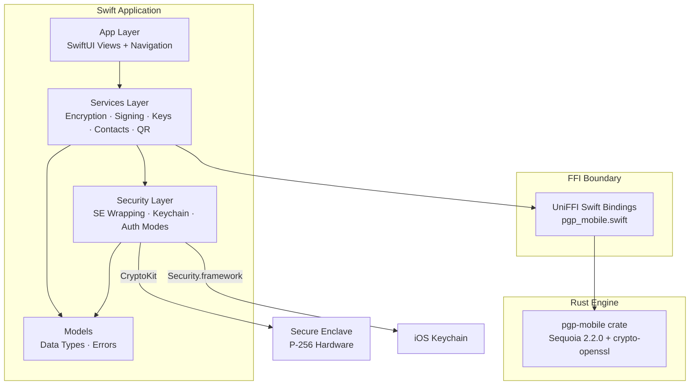
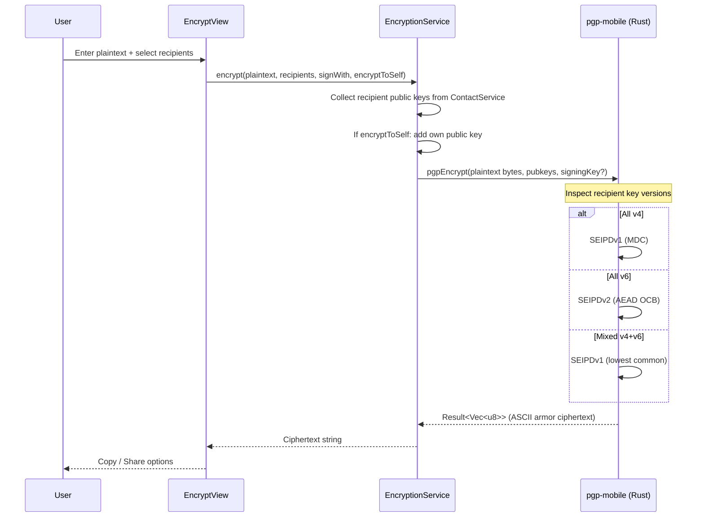
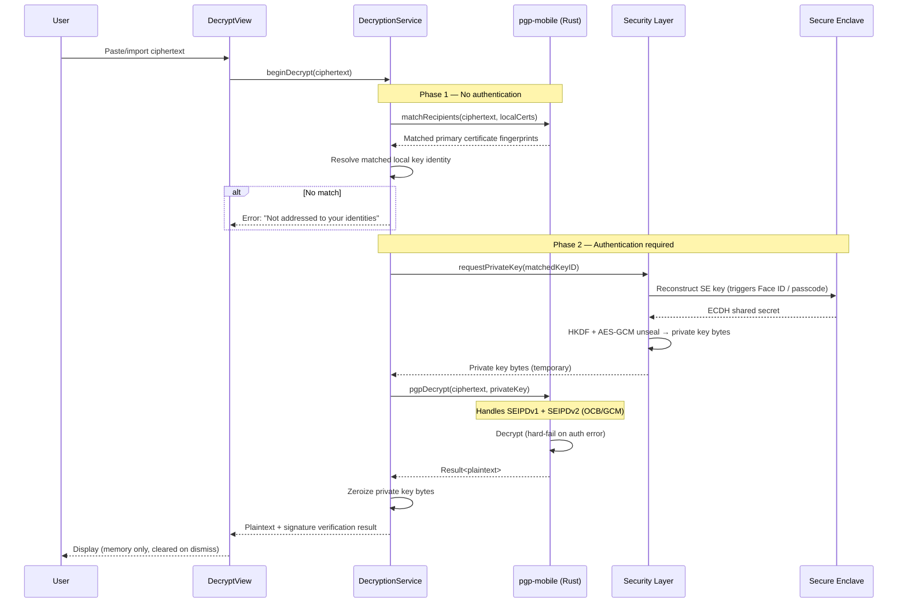
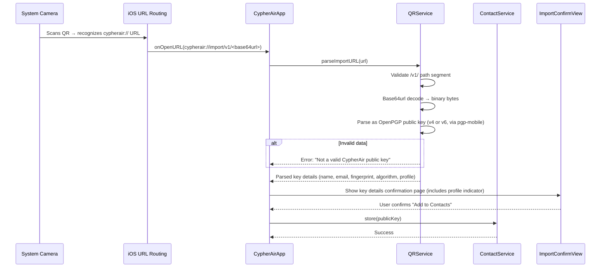
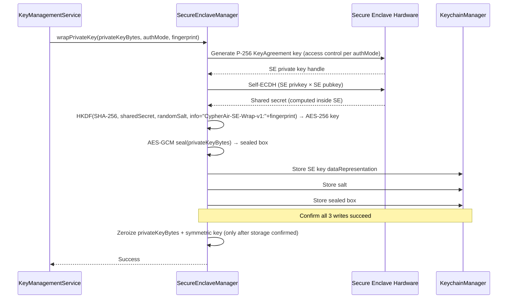
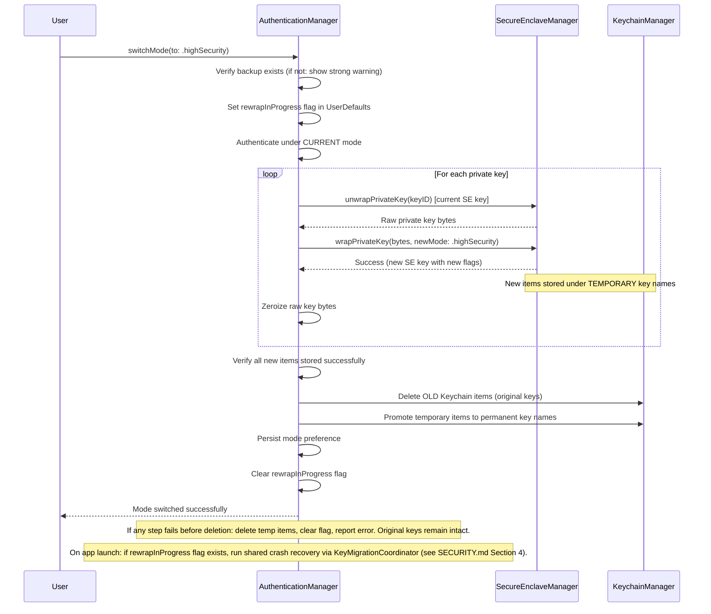

# Architecture

> Purpose: Module breakdown, dependency relationships, and data flow for CypherAir.
> Audience: Human developers and AI coding tools.

## 1. Layer Overview

CypherAir is a three-layer application: a SwiftUI presentation layer, a Swift services layer, and a Rust cryptographic engine bridged via UniFFI.



## 2. Module Breakdown

### App Layer (`Sources/App/`)

SwiftUI views, navigation routing, onboarding, and application composition. Views remain thin and call into the Services layer for all operations. Uses iOS 26 Liquid Glass design language — standard components auto-adopt; custom floating controls apply `.glassEffect()`.

Key files:

- `CypherAirApp.swift` — app entry point and scene configuration
- `AppContainer.swift` — centralized dependency construction
- `AppStartupCoordinator.swift` — cold-start loading, crash recovery, temporary file cleanup, startup warning aggregation
- `ContentView.swift` — root navigation
- `OnboardingView.swift` — first-run flow

### App Common Helpers (`Sources/App/Common/`)

Shared presentation-layer infrastructure used across multiple views.

| Helper | Responsibility |
|--------|---------------|
| `OperationController` | Shared task lifecycle, cancellation, progress state, error presentation, and clipboard notice handling for encrypt/decrypt/sign/verify flows |
| `SecurityScopedFileAccess` | Uniform wrapper around security-scoped file URL access |
| `FileExportController` | Shared `fileExporter` state for exporting generated data or existing files |
| `PrivacyScreenModifier` | Background blur + re-authentication gating |

### Services Layer (`Sources/Services/`)

Orchestrates user-facing operations by coordinating the Security layer and the Rust PGP engine.

| Service | Responsibility |
|---------|---------------|
| `EncryptionService` | Text/file encryption with recipient selection, encrypt-to-self, signature toggle, **auto format selection** (SEIPDv1/v2 by recipient key version) |
| `DecryptionService` | Two-phase decryption: header parse (Phase 1, no auth) → decrypt (Phase 2, auth required). Handles both SEIPDv1 and SEIPDv2. **Security-critical: Phase 1/Phase 2 boundary must never be bypassed.** |
| `PasswordMessageService` | Password/SKESK message encryption and decryption with optional signing. Separate from the recipient-key/two-phase decrypt flow; password-based decrypt does not use PKESK matching, while optional signing during password-message encryption may trigger Secure Enclave unwrap. |
| `SigningService` | Cleartext text signatures, detached file signatures, legacy verification summaries, and detailed signature-result service APIs used by the current verify workflows |
| `KeyManagementService` | Key generation (**profile-aware**: Profile A → Cv25519/RFC4880, Profile B → Cv448/RFC9580), import, export, expiry modification, revocation export, selector discovery, and selective revocation export through focused internal key-management helpers |
| `CertificateSignatureService` | Certificate-signature verification and User ID certification generation. Owns selector-validated certificate-signature workflows and signer identity resolution at the service boundary. |
| `ContactService` | Public key storage, same-fingerprint public update absorption, different-fingerprint replacement detection, flat list management |
| `QRService` | QR generation (CIQRCodeGenerator), QR decoding from photo (CIDetector), URL scheme parsing. **Security-critical: parses untrusted external input.** |
| `SelfTestService` | One-tap diagnostic covering **both profiles**: key gen → encrypt/decrypt → sign/verify → tamper test → QR round-trip |
| `FileProgressReporter` | Bridges Rust streaming progress callbacks to SwiftUI `@Observable` state. Implements UniFFI `ProgressReporter` protocol. Thread-safe via `OSAllocatedUnfairLock`. |
| `DiskSpaceChecker` | Runtime disk space validation before streaming file encryption. Uses `volumeAvailableCapacityForImportantUsageKey` to prevent Jetsam termination during large file operations. The legacy in-memory `encryptFile(...)` helper still retains its fixed 100 MB guard. |

### Security Layer (`Sources/Security/`)

Manages all hardware-backed security operations. This is the most sensitive module.

| Component | Responsibility |
|-----------|---------------|
| `SecureEnclaveManager` | P-256 key generation in SE, self-ECDH + HKDF + AES-GCM wrapping/unwrapping, key deletion. Same wrapping scheme for Ed25519/X25519/Ed448/X448. |
| `KeychainManager` | CRUD for Keychain items (SE key blob, salt, sealed box), access control flag configuration |
| `AuthenticationManager` | Standard/High Security mode logic, mode switching with SE key re-wrapping, LAContext evaluation, and auth-mode crash recovery |
| `KeyBundleStore` | Shared storage helper for 3-item wrapped key bundles (permanent/pending namespaces, rollback, replace-from-pending semantics) |
| `KeyMetadataStore` | Shared persistence helper for non-sensitive key metadata items |
| `KeyMigrationCoordinator` | Shared migration state machine for pending/permanent recovery, including safe/retryable/unrecoverable outcomes |
| `Argon2idMemoryGuard` | Validates `os_proc_available_memory()` against Argon2id S2K memory requirements before key import. 75% threshold prevents Jetsam termination. No-op for Profile A (Iterated+Salted S2K). |
| `MemoryZeroingUtility` | Extensions on `Data` and `Array<UInt8>` for secure clearing |

### Models (`Sources/Models/`)

Pure data types with no side effects. Includes Swift representations of PGP keys, error enums mapping from `PgpError`, user-facing error messages per PRD Section 4.7, configuration types (auth mode, grace period), and shared identity presentation helpers.

| Helper | Responsibility |
|--------|---------------|
| `IdentityPresentation` | Shared fingerprint formatting, short key ID derivation, user ID parsing, email extraction, and accessibility label generation |

### Rust Engine (`pgp-mobile/`)

The `pgp-mobile` Rust crate wraps `sequoia-openpgp` behind a UniFFI-annotated API. It exposes operations (generate, encrypt, decrypt, sign, verify, export, import) that accept/return `Vec<u8>` and `String`. All Sequoia internal types stay hidden behind this boundary.

```
pgp-mobile/
├── Cargo.toml        # sequoia-openpgp 2.2 + crypto-openssl + uniffi
├── src/
│   ├── lib.rs        # UniFFI proc-macros, public API surface
│   ├── keys.rs       # Profile-aware generation (Cv25519/RFC4880 vs Cv448/RFC9580)
│   ├── encrypt.rs    # Auto format selection by recipient key version
│   ├── decrypt.rs    # SEIPDv1 + SEIPDv2 (OCB/GCM), AEAD hard-fail
│   ├── password.rs   # Password / SKESK message encrypt/decrypt
│   ├── sign.rs       # Signing (cleartext + detached)
│   ├── verify.rs     # Signature verification with graded results
│   ├── streaming.rs  # File-path-based streaming I/O with progress reporting and cancellation
│   ├── armor.rs      # ASCII armor encode/decode
│   └── error.rs      # PgpError enum (maps 1:1 to Swift throwing functions)
├── tests/            # Rust-side unit + integration tests
└── uniffi-bindgen.rs # UniFFI CLI entrypoint used by the build script
bindings/
├── module.modulemap  # Xcode-imported module map alias
├── pgp_mobileFFI.h   # Generated C header
└── pgp_mobile.swift  # Generated Swift bindings synced into Sources/PgpMobile/
```

## 3. Data Flows

### Encrypt (Profile-Aware)



### Two-Phase Decrypt



### URL Scheme Public Key Import



### SE Key Wrapping



The wrapping scheme is identical for all key algorithms — the SE wraps raw private key bytes regardless of whether they are Ed25519, X25519, Ed448, or X448.

### Auth Mode Switching



## 4. Tightly Coupled Modules

These pairs must be updated together. A change to one without the other will cause build failures or runtime errors.

| Module A | Module B | Coupling Reason |
|----------|----------|----------------|
| `pgp-mobile/src/error.rs` | `Sources/Models/CypherAirError.swift` | PgpError enum variants must match 1:1 across FFI |
| `pgp-mobile/src/lib.rs` (public API) | `Sources/Services/*Service.swift` | Any Rust API change requires Swift call-site updates |
| `SecureEnclaveManager` | `KeychainManager` | SE wrapping writes 3 Keychain items; unwrapping reads them |
| `SecureEnclaveManager` | `AuthenticationManager` | Mode switch re-wraps all keys via SE manager |
| `DecryptionService` | `AuthenticationManager` | Phase 2 auth policy depends on current auth mode |
| `KeyManagementService` | `pgp-mobile/src/keys.rs` | Profile → CipherSuite mapping must stay synchronized |

## 5. Storage Layout

```
iOS Keychain (kSecClassGenericPassword, WhenUnlockedThisDeviceOnly):
├── Per identity (fingerprint = lowercase hex, no spaces/separators):
│   ├── com.cypherair.v1.se-key.<fingerprint>        → SE key dataRepresentation
│   ├── com.cypherair.v1.salt.<fingerprint>           → Random HKDF salt
│   ├── com.cypherair.v1.sealed-key.<fingerprint>     → AES-GCM sealed private key
│   └── com.cypherair.v1.metadata.<fingerprint>       → PGPKeyIdentity JSON (Codable, no SE auth needed)
│
├── During mode switch / modify-expiry recovery (temporary, deleted after successful promotion or stale cleanup):
│   ├── com.cypherair.v1.pending-se-key.<fingerprint>
│   ├── com.cypherair.v1.pending-salt.<fingerprint>
│   └── com.cypherair.v1.pending-sealed-key.<fingerprint>

App Sandbox:
├── Documents/
│   ├── contacts/                → Public key files (.gpg binary)
│   │   └── contact-metadata.json → Verification-state manifest for stored contacts
│   └── self-test/               → Self-test reports
├── Library/Preferences/
│   └── (UserDefaults)
│       ├── com.cypherair.preference.authMode              → "standard" | "highSecurity"
│       ├── com.cypherair.preference.gracePeriod            → Int (seconds): 0 / 60 / 180 / 300
│       ├── com.cypherair.preference.encryptToSelf          → Bool (default true)
│       ├── com.cypherair.preference.clipboardNotice        → Bool (default true)
│       ├── com.cypherair.preference.requireAuthOnLaunch    → Bool (default true)
│       ├── com.cypherair.preference.onboardingComplete     → Bool (default false)
│       ├── com.cypherair.preference.guidedTutorialCompletedVersion → Int (default 0)
│       ├── com.cypherair.preference.colorTheme             → String (ColorTheme rawValue, default "systemDefault")
│       ├── com.cypherair.internal.rewrapInProgress         → Bool (crash recovery flag)
│       ├── com.cypherair.internal.rewrapTargetMode         → String (target auth mode during re-wrap)
│       ├── com.cypherair.internal.modifyExpiryInProgress   → Bool (crash recovery flag)
│       └── com.cypherair.internal.modifyExpiryFingerprint  → String (key fingerprint during expiry modification)
└── tmp/
    ├── decrypted/               → Decrypted file previews (deleted on view exit + app launch)
    └── streaming/               → Temporary streaming encrypt/decrypt outputs (deleted on app launch)
```

**Keychain key naming conventions:**
- All keys prefixed with `com.cypherair.v1.` — the `v1` segment enables future data migration if the wrapping scheme changes.
- `<fingerprint>` is the full key fingerprint in lowercase hexadecimal, no spaces or separators (e.g., `a1b2c3d4...`).
- Metadata items use `metadata.` prefix and store `PGPKeyIdentity` as JSON. These items have no access control (no SE authentication required) and are used for cold-launch key enumeration via `KeyManagementService.loadKeys()`.
- Temporary keys during mode switch and modify-expiry recovery use `pending-` prefix. Crash recovery prefers any complete bundle over a partial bundle and leaves retry flags set if recovery fails for a retryable reason.

## 6. Memory Integrity Enforcement

MIE is built right into Apple hardware and software in all models of iPhone 17 and iPhone Air (A19/A19 Pro). It is enabled via the Enhanced Security capability in Xcode, adding hardware memory tagging (EMTE) that protects all C/C++ code — including vendored OpenSSL — against buffer overflows and use-after-free.

The capability is configured in Xcode 26 via Signing & Capabilities → Add Capability → Enhanced Security. Xcode manages this through the `ENABLE_ENHANCED_SECURITY = YES` build setting and writes the required entitlement keys (Hardened Process, Hardened Heap, Enhanced Security version, Platform Restrictions, Read-Only Platform Memory, Hardware Memory Tagging, etc.) into `CypherAir.entitlements`. These entitlement keys must be committed to source control — Xcode reads them to determine which protections are enabled. See [SECURITY.md](SECURITY.md) Section 6.

On older devices without A19/A19 Pro chips, the app runs normally — the capability is additive and never breaks compatibility with older devices. See [SECURITY.md](SECURITY.md) Section 6 for the full testing workflow.
