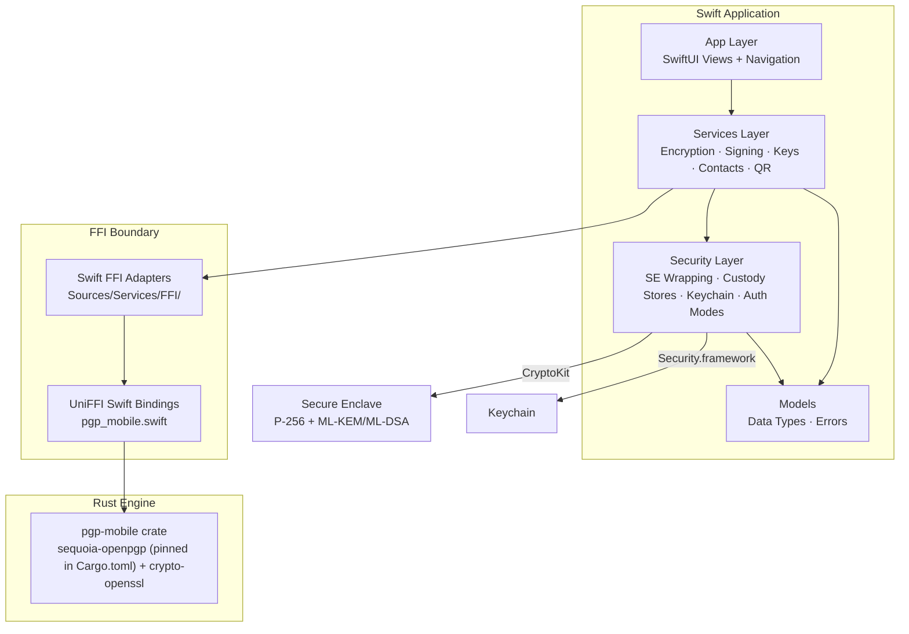
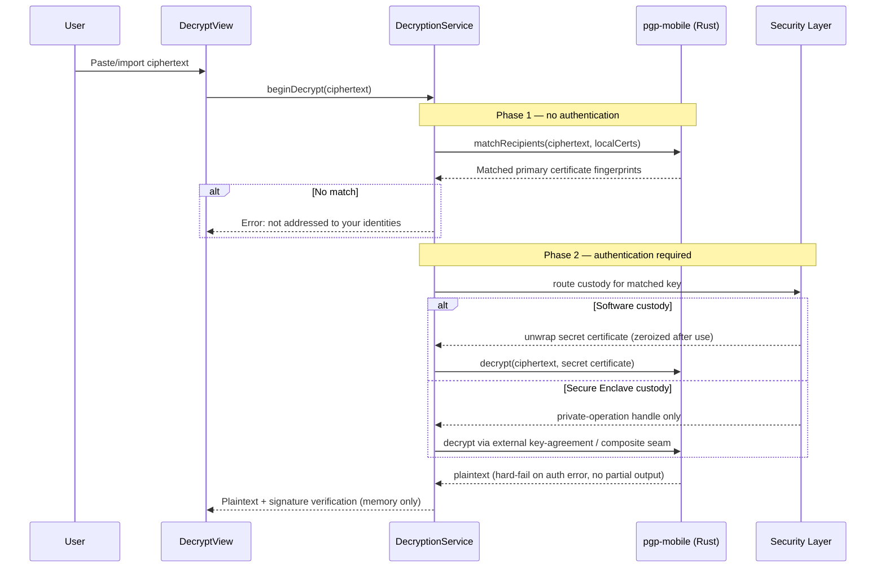

# Architecture

> Status: Canonical current-state.
> Purpose: Module breakdown, dependency relationships, and data flow for CypherAir.
> Audience: Human developers and AI coding tools.
> Update triggers: Module ownership, the FFI adapter surface, data flows, tightly-coupled pairs, or storage layout change.
> Last reviewed: 2026-07-17.

## 1. Layer Overview

CypherAir is a layered application: a SwiftUI presentation layer, a Swift services layer, a Security layer, app-owned Models, and a Rust cryptographic engine reached through Swift FFI adapters and generated UniFFI bindings.



## 2. Module Breakdown

### App Layer (`Sources/App/`)

SwiftUI views, navigation, onboarding, and application composition. Views stay thin and call the Services layer for all operations; workflow-heavy screens move orchestration into `@Observable` ScreenModels; styling reuses the `DesignSystem/` primitives (`CypherSpacing`, `CypherRadius`, `View.cypherSurface(_:)` — style rules: CLAUDE.md Code Style).

Composition and infrastructure files at the top level: `CypherAirApp` (entry point, scene wiring), `AppContainer` (centralized dependency construction, shared default/UI-test graph helpers), `AppStartupCoordinator` (synchronous pre-auth bootstrap, cold-start loading, crash recovery, temp-file cleanup, startup warnings), `AppRoute` + `AppShellComposition` + `Shell/` (route model and per-platform shells: iOS tabs, macOS split-view presentation, keyboard commands), `AppLaunchConfiguration` (launch/UI-test environment parsing), `AppLoadWarningCoordinator`, `ContentView`/`HomeView`. Feature surfaces live in `Encrypt/`, `Decrypt/`, `Sign/`, `Keys/`, `Contacts/` (including `Import/AppSceneIncomingURLRouter` for scene-level URL handoff), `Settings/` (including `LocalDataResetService`, `ProtectedSettingsAccessCoordinator`, `ProtectedSettingsHost`), and `Onboarding/`.

Cross-cutting app infrastructure grouped by concern — file-I/O and async-operation plumbing under `FileIO/`, app lifecycle/lock/identity under `Shell/` (`Common/` retains only the shared `TextImport/` input state):

| Helper | Home | Responsibility |
|--------|------|---------------|
| `OperationController` | `FileIO/` | Shared task lifecycle, cancellation, progress, error presentation, and clipboard notices for encrypt/decrypt/sign/verify flows |
| `SecurityScopedFileAccess` | `FileIO/` | Uniform wrapper around security-scoped file URL access |
| `FileExportController` | `FileIO/` | Shared `fileExporter` state for exporting generated data or existing files |
| `CosmeticPrivacyCover` | `Shell/` | Pure content-obscuring overlay whenever the app is not foreground-active; zero coupling to authentication (cover ≠ lock) |
| `AppLockSurfaceView` | `Shell/` | Opaque lock surface driven by `AppLockController.lockState`; auto-invokes system authentication on appear, hosts retry/lockout messaging |
| `AppLockShieldWindow` | `Shell/` | Per-platform window bridge (UIKit/AppKit) that hosts `AppLockSurfaceView` in a shield window above the entire presentation stack while locked — sheets, covers, and macOS window-modal sheets included — without dismissing any presentation |
| `AppLifecycleObserver` | `Shell/` | Routes platform lifecycle signals (ScenePhase / app-resign / screen-lock) into `AppLockController` foreground-active and away events |

### Guided Tutorial (`Sources/App/Onboarding/Tutorial/`)

A host-driven sandbox (`TutorialView`, `TutorialSessionStore`, `TutorialSandboxContainer`) that teaches the real workflow against a separate dependency graph — fixed `com.cypherair.tutorial.sandbox` defaults suite, temporary contacts directory, real services over real ephemeral security primitives: promptless real-Secure Enclave wrapping (`EphemeralKeyWrappingCustody`), an in-memory keychain wiped at cleanup (`EphemeralKeychainStore`), and inert fail-closed device-bound custody seams (`InertCustodyStores.swift`). Route blocklisting and output interception keep the sandbox isolated; the custody and containment rules live in [SECURITY.md](SECURITY.md) §6.

### Services Layer (`Sources/Services/`)

Orchestrates user-facing operations by coordinating the Security layer, Models, and the FFI adapters. Services never call `PgpEngine` directly — each operation family has a dedicated adapter.

| Service | Responsibility |
|---------|---------------|
| `EncryptionService` | Text/file encryption with recipient selection, encrypt-to-self, optional signing, and automatic format selection by recipient key version ([TDD.md](TDD.md) §1.4). Signing delegates to router-owned private-key helpers: software custody unwraps/zeroizes, Secure Enclave routes use the external signer seam. |
| `DecryptionService` | Two-phase decryption: header parse (Phase 1, no auth) → decrypt (Phase 2, auth required). Phase 2 delegates custody dispatch to `PrivateKeyMessageDecryptionService` / `PrivateKeyStreamingFileDecryptionService`: software custody unwraps and zeroizes the secret certificate; Secure Enclave routes load only the needed private-operation handle. Handles SEIPDv1 and SEIPDv2. **Security-critical: the Phase 1/Phase 2 boundary must never be bypassed.** |
| `PasswordMessageService` | Password/SKESK message encryption/decryption with optional signing, through the app-owned password-message format. Separate from the recipient-key two-phase flow; no PKESK matching. |
| `SigningService` | Cleartext text signatures, detached file signatures, detailed signature results. Private signing dispatches through router-owned helpers (software unwrap/zeroize vs Secure Enclave signer routes). |
| `KeyManagementService` | Key generation across all nine families — Portable Legacy (Cv25519/RFC 4880), Portable Modern (Cv25519/RFC 9580), Portable Modern · High (Cv448/RFC 9580), Portable Post-Quantum (RFC 9980 ML-DSA-65/ML-KEM-768 composite), Portable Post-Quantum · High (RFC 9980 ML-DSA-87/ML-KEM-1024 composite), Device-Bound Legacy/Modern (Secure Enclave custody P-256 v4/v6), Device-Bound Post-Quantum and Device-Bound Post-Quantum · High (split custody via `CompositeCustodyRouterContext`) — plus import, export, expiry modification, revocation and selective-revocation export, and selector discovery. Implementation helpers live in `KeyManagement/`. |
| `PGPKeyCapabilityResolver` | Pure policy resolver for OpenPGP configuration, private-key custody, operation-support vocabulary, and sanitized failure categories. Gates generation, signing-class, and key-agreement operations independently; private-material export for device-bound keys stays hard-unsupported independent of policy. |
| `PrivateKeyOperationRouter` | Routes private-operation requests: software secret-certificate routes (returned without unwrapping), Secure Enclave signer/key-agreement/composite routes after public-binding and handle checks, or blocked resolutions. A Secure Enclave route never falls back to software secret material. |
| `CertificateSignatureService` | Certificate-signature verification and User ID certification generation; validates selectors and generated artifacts at the service boundary. |
| `ContactService` | The only app/UI-facing Contacts facade: person-centered import/update, verification state, search/tags, `ContactKeyRecord` lookups, protected-domain runtime projection, mutation rollback, relock cleanup. Consumers use key-record lookups or `ContactsVerificationContext`, never flat contact projections. |
| `QRService` | QR generation (`CIQRCodeGenerator`), QR decoding from photo (`CIDetector`), URL-scheme parsing. **Security-critical: parses untrusted external input.** |
| `SelfTestService` | One-tap diagnostic across the software profiles: key gen → encrypt/decrypt → sign/verify → tamper → QR round-trip. |
| `FileProgressReporter` | Observable progress/cancellation for streaming operations, bridged to UniFFI progress callbacks. |
| `DiskSpaceChecker` | Disk-space validation before streaming file encryption (`volumeAvailableCapacityForImportantUsageKey`) to prevent Jetsam termination. |

`Sources/Services/KeyManagement/` holds the router-owned private-key operation helpers (text/streaming encryption, message/streaming decryption, cleartext/detached signing, password-message encryption, expiry mutation, selective revocation, contact certification), the custody generation/recovery services, and the key catalog/provisioning stores. `Sources/Services/Common/` holds the shared service utilities — disk-space checks, progress reporting, QR, certificate inspection, and the SQLCipher raw-key helper for Contacts persistence.

### FFI Adapters (`Sources/Services/FFI/`)

The adapter layer contains the generated-API call sites used by the Services layer, generated-error normalization (`PGPErrorMapper` → `CypherAirError`), progress bridging, and result mapping. (One deliberate exception: `EncryptScreenModel` calls the stateless generated engine directly for quantum-safety classification — see the coupled-pairs table.) The convention is one adapter per operation domain; the directory listing is the source of truth. Current groups:

- **Operation adapters** — one per domain: key, certificate, certificate-selection, key-metadata, message (+ result mapper), contact-import, self-test.
- **External-provider bridges** — Swift implementations of the Rust private-operation seams: P-256 signing and key agreement, ML-DSA-65 and ML-DSA-87 signing, ML-KEM-768 and ML-KEM-1024 decapsulation.
- **Custody generation/inspection** — custody generation adapters and public-binding inspectors for the P-256 families and the split-custody post-quantum family.

### Secure Enclave Custody Boundary

Device-bound families keep private-key operations inside the Secure Enclave instead of wrapping software secret certificates. Ownership is split across three layers — the Rust `Signer`/`Decryptor` seam (Rust keeps all OpenPGP packet construction and derivation; callbacks return only signatures/shared secrets/key shares), the Security-layer custody stores, and capability-resolver + router dispatch. For Device-Bound Post-Quantum, custody itself is split: ML-DSA/ML-KEM components are enclave-resident while the classical components live in a fixed-access software envelope. The full contract, red lines, and operation surface live in [SECURE_ENCLAVE_CUSTODY.md](SECURE_ENCLAVE_CUSTODY.md) §2–§4, the hardware evidence in its §8; this document only places the boundary in the module map.

### Security Layer (`Sources/Security/`)

All hardware-backed security operations. The most sensitive module — see [SECURITY.md](SECURITY.md) §10 for the review gate.

| Component | Responsibility |
|-----------|---------------|
| `SecureEnclaveManager` | Software-custody wrapping: P-256 key generation in SE, ephemeral-static ECDH + HKDF + AES-GCM (AAD-bound) `CAPKEV5` envelope seal/open, key deletion. Same scheme for every software-key algorithm. |
| `KeychainManager` | CRUD for Keychain items (private-key envelope rows and ProtectedData support rows), access-control flag configuration |
| `AuthenticationManager` | Standard/High Security mode logic, mode switching with SE re-wrap, `LAContext` evaluation, post-unlock auth-mode crash recovery |
| `PrivateKeyModeSwitchAuthenticator` / `PrivateKeyRewrapWorkflow` / `PrivateKeyRewrapRecoveryCoordinator` | Current-mode gate, two-phase rewrap workflow (pending rows → verify → promote), and phase-aware interrupted-rewrap recovery |
| `KeyBundleStore` / `PrivateKeyRewrapRecoveryStrategy` | Single-row envelope storage (permanent/pending namespaces, rollback, replace-from-pending) and the shared rewrap-recovery state machine (safe/retryable/unrecoverable outcomes) |
| `SecureEnclaveCustodyHandleStore` | Tier-scoped lifecycle boundary for the role-separated device-bound custody handles (CryptoKit `dataRepresentation` blob rows; P-256 for the classical tier, ML-DSA/ML-KEM components for the post-quantum tiers): public-binding/role checks, rollback, non-prompting locate/inspect, idempotent delete, cross-tier inventory and local-reset cleanup, sanitized failure mapping |
| `SecureEnclaveCustodyKeyAgreement` | CryptoKit ECDH bridge for the external P-256 key-agreement route; validates handles, bindings, and ephemeral-key shape; returns only the raw shared secret |
| `SecureEnclaveCompositeClassicalComponentStore` | Fixed-access `CAPKEV5` envelope custody for the classical components — Ed25519+X25519 for the base tier, Ed448+X448 for the · High tier (exempt from mode-switch re-wrap) |
| `SecureEnclaveCompositeOperations` | In-enclave ML-DSA signing and ML-KEM decapsulation primitives (ML-DSA-65/ML-KEM-768 and ML-DSA-87/ML-KEM-1024) consumed by the composite provider bridges |
| `Argon2idMemoryGuard` | Validates `os_proc_available_memory()` against Argon2id S2K requirements before key import; 75% threshold ([SECURITY.md](SECURITY.md) §7) |
| `MemoryZeroingUtility` | Extensions on `Data` and `[UInt8]` for secure clearing |
| `EphemeralKeyWrappingCustody` / `EphemeralKeychainStore` | Ephemeral sandbox custody for the guided tutorial and the DEBUG UI-test container: real promptless Secure Enclave wrapping (fail-closed without an enclave) and an in-memory keychain with real row semantics, own error types, and a zeroizing wipe ([SECURITY.md](SECURITY.md) §6). |

### ProtectedData (`Sources/Security/ProtectedData/`)

The protected app-data framework: registry and storage root (`ProtectedDataRegistry`/`ProtectedDataRegistryStore`, `ProtectedDataStorageRoot`), root-secret custody (`ProtectedDataRootSecretCoordinator`, `ProtectedDataRootSecretEnvelope` — the `CAPDSEV5` codec with the folded SE device-binding key, `KeychainProtectedDataRootSecretStore`, `ProtectedDataDeviceBinding`), session ownership (`ProtectedDataSessionCoordinator`, `AppSessionOrchestrator`, `AppLockController`, relock coordination), per-domain key custody (`ProtectedDomainKeyManager` with the `CADMKV5` wrapped-DMK codec), recovery (`ProtectedDomainRecoveryCoordinator`/handlers), the post-unlock opener (`ProtectedDataPostUnlockCoordinator`), and the domain stores (`PrivateKeyControlStore`, `KeyMetadataDomainStore`, `ProtectedSettingsStore` + ordinary-settings adapters, `ContactsDomainStore` + `ContactsSQLCipherDatabase`, `ProtectedDataFrameworkSentinelStore`).

Ownership facts the file names don't show (security invariants live in [SECURITY.md](SECURITY.md) §3 and §5):

- App privacy unlock runs one post-unlock opener pass that reuses the authenticated `LAContext` to open all eligible committed domains (`private-key-control`, `key-metadata`, `protected-settings`, sentinel) without a second prompt; Contacts joins the session through its dedicated post-auth open path.
- Settings refresh may auto-open protected settings only by consuming an existing app-session `LAContext` handoff — the handoff-only path never starts a new interactive prompt.
- `KeyMetadataDomainStore` is the key-metadata source of truth; it is recoverable after unlock but never silently rebuilt from private-key envelope rows.

The canonical row-level classification and migration-readiness table is [PERSISTED_STATE_INVENTORY.md](PERSISTED_STATE_INVENTORY.md); this section names component owners, not rows.

### Models (`Sources/Models/`)

Shared app-owned models: PGP key representations (`PGPKeyIdentity`, `PGPKeyFamily`, `PGPKeySuite`, custody kinds), the `CypherAirError` vocabulary, operation-support/failure-category types, ordinary-settings snapshot/persistence coordination, Contacts validation values, and identity parsing/formatting (`IdentityPresentation`). Generated `PgpError` normalization lives in the FFI mapper boundary, not Models; ProtectedData/Security implementation state is reduced to app-owned availability values before reaching Models.

### Rust Engine (`pgp-mobile/`)

Wraps `sequoia-openpgp` (version pinned in `pgp-mobile/Cargo.toml`, `crypto-openssl` backend) behind a UniFFI-annotated API taking/returning `Vec<u8>`/`String`. Sequoia types never cross the boundary.

```
pgp-mobile/src/
├── lib.rs                      # UniFFI proc-macros, public API surface
├── keys.rs + keys/             # generation, secure_enclave_generation/, composite_custody_generation/,
│                               #   key_info, selector_discovery, public_certificates, secret_transfer,
│                               #   revocation, profile, s2k, expiry
├── encrypt.rs                  # Auto format selection by recipient key version; AES-256 PQ floor
├── decrypt.rs                  # SEIPDv1 + SEIPDv2 (OCB/GCM), AEAD hard-fail, message_quantum_safety
├── password.rs                 # Password / SKESK messages
├── sign.rs / verify.rs / signature_details.rs / cert_signature.rs
├── external_signer.rs + /      # External P-256 signer seam
├── external_decryptor.rs + /   # External P-256 key-agreement seam
├── external_composite_signer.rs + /       # ML-DSA-65+Ed25519 composite signer seam
├── external_composite_decryptor.rs + /    # ML-KEM-768+X25519 composite decrypt seam
├── composite_classical.rs / composite_kem.rs  # classical component handling; vendored RFC 9980 KEM combiner
├── streaming.rs                # File-path streaming I/O with progress + cancellation
└── qr_url.rs / armor.rs / error.rs
```

(`pgp-mobile/uniffi-bindgen.rs`, at the crate root, is the bindgen entrypoint used by the build script.)

The artifact shape of `PgpMobile.xcframework`, the `pgp_mobileFFI` module name, and why the generated UniFFI outputs are tracked in-tree rather than restored on demand are recorded — with the triggers that would reopen them — in [FFI_ARTIFACT_DECISION.md](FFI_ARTIFACT_DECISION.md).

## 3. Data Flows

**Encrypt** collects recipient keys (plus own key when encrypt-to-self is on) and calls the message adapter; the Rust engine selects the format from recipient key versions ([TDD.md](TDD.md) §1.4) and classifies quantum safety for the result indicator. **SE wrapping and auth-mode switching** choreography is owned by [SECURITY.md](SECURITY.md) §3–§4. The two flows below earn diagrams because their boundaries are security-critical and non-obvious.

### Two-Phase Decrypt



### Protected App Data Unlock


Locked, recovery, pending-mutation, or framework-unavailable registry states block domain open (and fail ordinary settings closed to recovery) until recovery completes.

## 4. Tightly Coupled Modules

These pairs must be updated together; a change to one without the other causes build failures or runtime errors.

| Module A | Module B | Coupling reason |
|----------|----------|----------------|
| `pgp-mobile/src/error.rs` | `Sources/Services/FFI/PGPErrorMapper.swift` + `Sources/Models/CypherAirError.swift` | Generated `PgpError` variants are normalized only at the FFI mapper boundary into the app-owned vocabulary |
| Rust external-operation seams (`external_signer.rs`, `external_decryptor.rs`, `external_composite_*.rs`) | The `PGPExternal*ProviderBridge` adapters | Callback wire contracts and sanitized error categories must stay in lockstep; callback failures never travel as free-form strings |
| `pgp-mobile/src/lib.rs` (public API) | `Sources/Services/FFI/*Adapter.swift` | Any Rust API change requires matching adapter updates |
| `pgp-mobile/src/keys.rs` | `PGPKeyOperationAdapter` | Profile → CipherSuite mapping and key-operation result mapping stay synchronized |
| `pgp-mobile` message classification (`message_quantum_safety`) | `EncryptScreenModel` result indicator | The compose quantum-safety badge derives from the artifact-level classification |
| `SecureEnclaveManager` | `KeychainManager` | SE wrapping writes the single `privkey-envelope` row; unwrapping reads it |
| `SecureEnclaveManager` | `AuthenticationManager` | Mode switch re-wraps all software-custody keys via the SE manager |
| `DecryptionService` | `AuthenticationManager` | Phase 2 auth policy depends on the current auth mode |

## 5. Storage Layout

```
Keychain (kSecClassGenericPassword, data-protection Keychain, default account):
├── com.cypherair.v5.privkey-envelope.<fingerprint>          → CAPKEV5 private-key envelope (software custody;
│                                                              also the composite classical-component envelope)
├── com.cypherair.v5.pending-privkey-envelope.<fingerprint>  → temporary mode-switch / expiry-recovery row
├── com.cypherair.v5.protected-data.shared-right             → LA-gated CAPDSEV5 app-data root-secret envelope
│                                                              (single self-contained row, SE binding key folded in)
├── com.cypherair.v5.protected-data.domain-key.<domainID>          → committed CADMKV5 wrapped domain master key
├── com.cypherair.v5.protected-data.domain-key.staged.<domainID>   → staged row during validation/promotion
└── com.cypherair.v5.secure-enclave-custody.<tier>.<role> (account = handle-set id)
                                                              → enclave key blob rows for every device-bound tier
                                                                (p256 / post-quantum / post-quantum-high)

App Sandbox:
├── Application Support/ProtectedData/
│   ├── ProtectedDataRegistry.plist
│   ├── private-key-control/  key-metadata/  protected-settings/
│   ├── contacts/                → contacts.sqlite (SQLCipher) + sidecars
│   └── protected-framework-sentinel/
├── Library/Preferences/
│   ├── com.cypherair.preference.appSessionAuthenticationPolicy  → boot auth profile (UserDefaults)
│   └── com.cypherair.tutorial.sandbox.plist                     → fixed tutorial suite; startup/reset cleanup
└── tmp/
    ├── decrypted/op-<UUID>/  streaming/op-<UUID>/  export-<UUID>-<filename>
    └── CypherAirGuidedTutorial-<UUID>/            (all with verified complete file protection)
```

Naming and custody rules:

- Private-key, domain-key, custody, composite, and root-secret rows are all prefixed `com.cypherair.v5.` (the version segment is the schema generation of the persisted format family, nothing more); only the Preferences keys sit outside it. `<fingerprint>` is full lowercase hex; temporary rows use the `pending-` prefix.
- Custody handle tags and composite handle-set ids are Security-private local locators — never written to ProtectedData metadata, logs, UI, exports, or Rust. Recovery derives expected handles from public certificate bindings.
- Domain-key rows carry no per-row biometric access control; unwrapping still requires the post-auth wrapping root key.
- The ProtectedData device-binding key is a separate SE key that exists only inside the folded `CAPDSEV5` envelope — flags and domain separation: [SECURITY.md](SECURITY.md) §3 "ProtectedData Device-Binding Note".

Row-level classification, status, and migration readiness: [PERSISTED_STATE_INVENTORY.md](PERSISTED_STATE_INVENTORY.md).

## 6. Memory Integrity Enforcement

MIE adds hardware memory tagging protecting all C/C++ code — including vendored OpenSSL — on supported hardware. It is enabled through the Enhanced Security capability (`ENABLE_ENHANCED_SECURITY = YES`); the entitlement keys stay committed to source control. Canonical entitlement list, device support, and validation workflow: [SECURITY.md](SECURITY.md) §8.
