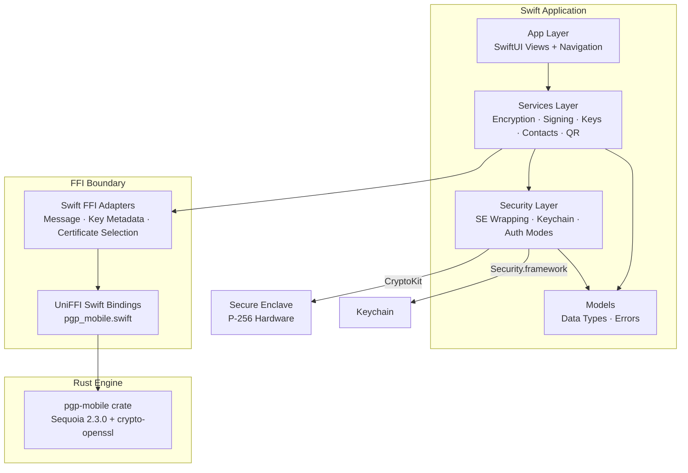
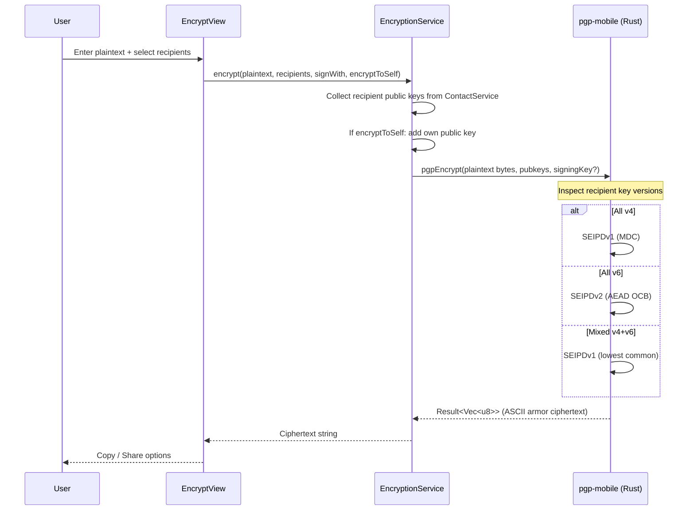
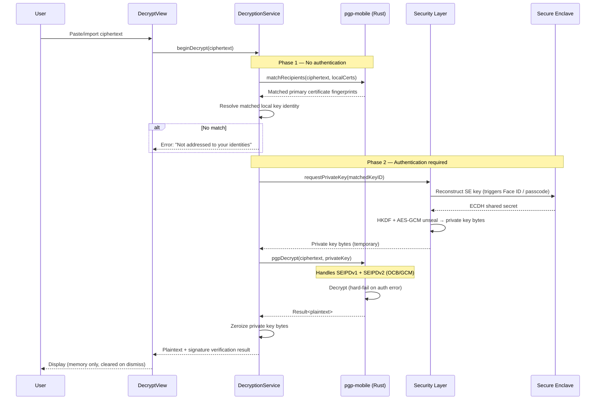
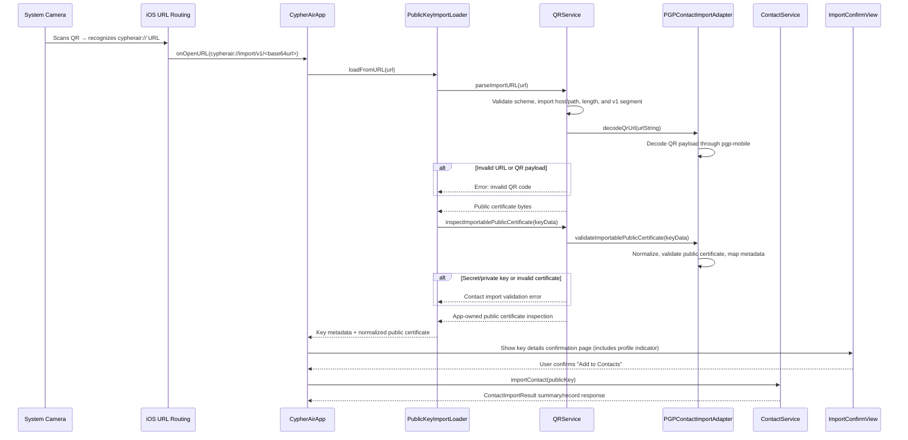
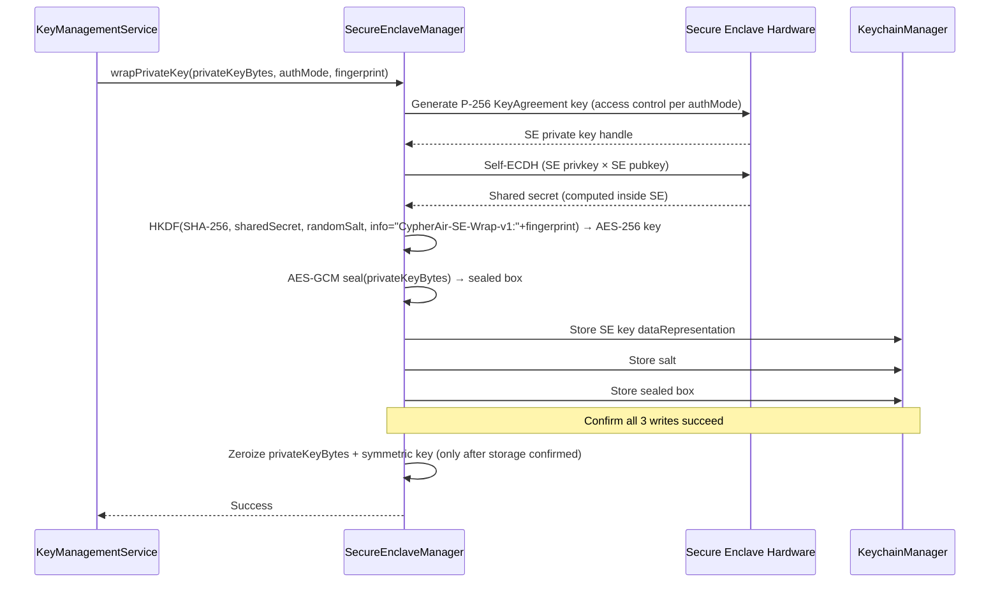
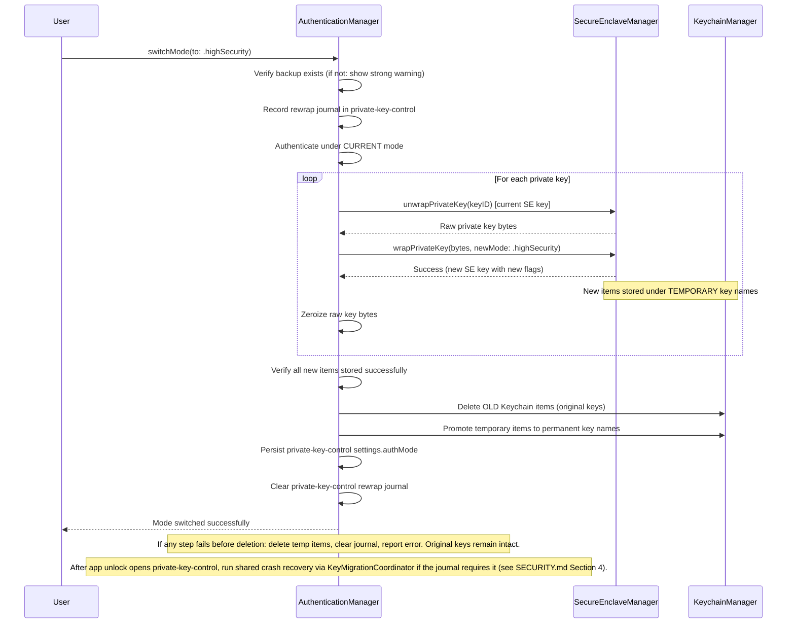
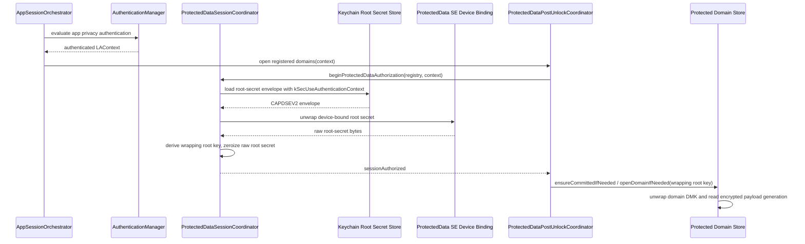

# Architecture

> Purpose: Module breakdown, dependency relationships, and data flow for CypherAir.
> Audience: Human developers and AI coding tools.

## 1. Layer Overview

CypherAir is a layered application: a SwiftUI presentation layer, a Swift
services layer, a Security layer, app-owned Models, and a Rust cryptographic
engine reached through Swift FFI adapters and generated UniFFI bindings.



## 2. Module Breakdown

### App Layer (`Sources/App/`)

SwiftUI views, navigation routing, onboarding, and application composition. Views remain thin and call into the Services layer for all operations. Uses iOS 26 Liquid Glass conventions where applicable and native platform SwiftUI chrome elsewhere. Standard components auto-adopt; custom floating controls apply `.glassEffect()` only where the API is available and platform-appropriate.

Key files:

- `CypherAirApp.swift` — app entry point, scene wiring, environment injection, and presentation modifiers
- `AppLaunchConfiguration.swift` — launch and UI-test environment parsing
- `AppLoadWarningCoordinator.swift` — load-warning pending/presentation gate state
- `AppContainer.swift` — centralized dependency construction with shared graph helpers for common default/UI-test wiring
- `AppStartupCoordinator.swift` — synchronous pre-auth bootstrap, cold-start loading, crash recovery, temporary file cleanup, startup warning aggregation
- `LocalDataResetService.swift` — destructive reset workflow for CypherAir-owned Keychain items, ProtectedData files, contacts, defaults, temporary files, and in-memory session state
- `LocalDataResetRestartAction.swift` — platform restart/termination action after local-data reset
- `AppSceneIncomingURLRouter.swift` — scene-level URL handoff into the incoming contact-import coordinator
- `ProtectedSettingsAccessCoordinator.swift` — protected-settings access, migration, open-domain, reset, retry, and clipboard-notice mutation authorization workflow policy
- `ProtectedSettingsHost.swift` — SwiftUI-facing protected-settings host, section-state projection, environment injection, and presentation trace metadata
- `ContentView.swift` — root navigation
- `OnboardingView.swift` — first-run flow and guided tutorial decision page
- `Onboarding/Tutorial*` — sandboxed guided tutorial host, session store, shell, and page-configuration seams

### App Common Helpers (`Sources/App/Common/`)

Shared presentation-layer infrastructure used across multiple views.

| Helper | Responsibility |
|--------|---------------|
| `OperationController` | Shared task lifecycle, cancellation, progress state, error presentation, and clipboard notice handling for encrypt/decrypt/sign/verify flows |
| `SecurityScopedFileAccess` | Uniform wrapper around security-scoped file URL access |
| `FileExportController` | Shared `fileExporter` state for exporting generated data or existing files |
| `PrivacyScreenModifier` | Background blur + re-authentication gating as a thin UI adapter over `AppSessionOrchestrator` |
| `AuthenticationShieldCoordinator` | Authentication shield prompt depth, pending-dismissal timing, lifecycle observations, and trace state transitions |
| `AuthenticationShieldHost` | SwiftUI environment key, host modifier, and platform lifecycle adapter for the authentication shield |
| `AuthenticationShieldOverlayView` | Authentication shield overlay/card rendering and animation |

### Services Layer (`Sources/Services/`)

Orchestrates user-facing operations by coordinating the Security layer, app-owned
models, and FFI adapters. Message encryption/decryption, password-message,
key-generation/import/export/expiry, QR, contact-import, and self-test operations
call dedicated FFI adapters rather than `PgpEngine` directly.

| Service | Responsibility |
|---------|---------------|
| `EncryptionService` | Text/file encryption with recipient selection, encrypt-to-self, signature toggle, **auto format selection** (SEIPDv1/v2 by recipient key version) through the message FFI adapter |
| `DecryptionService` | Two-phase decryption: header parse (Phase 1, no auth) → decrypt (Phase 2, auth required). Generated decrypt calls and result mapping live behind the message FFI adapter. Handles both SEIPDv1 and SEIPDv2. **Security-critical: Phase 1/Phase 2 boundary must never be bypassed.** |
| `PasswordMessageService` | Password/SKESK message encryption and decryption with optional signing through an app-owned password-message format and the message FFI adapter. Separate from the recipient-key/two-phase decrypt flow; password-based decrypt does not use PKESK matching, while optional signing during password-message encryption may trigger Secure Enclave unwrap. |
| `SigningService` | Cleartext text signatures, detached file signatures, and detailed signature-result service APIs used by current verify workflows |
| `KeyManagementService` | Key generation (**profile-aware**: Profile A → Cv25519/RFC4880, Profile B → Cv448/RFC9580), import, export, expiry modification, revocation export, selector discovery, and selective revocation export through focused internal key-management helpers and key/certificate FFI adapters |
| `CertificateSignatureService` | Certificate-signature verification and User ID certification generation. Owns selector-validated certificate-signature workflows and signer identity resolution at the service boundary. |
| `ContactService` | App/UI-facing Contacts facade for availability, person-centered public-key import/update through the contact-import FFI adapter, verification state, search/tags, key-record lookup APIs, protected-domain runtime projection, mutation rollback, and relock cleanup |
| `QRService` | QR generation (CIQRCodeGenerator), QR decoding from photo (CIDetector), URL scheme parsing through the contact-import FFI adapter. **Security-critical: parses untrusted external input.** |
| `SelfTestService` | One-tap diagnostic covering **both profiles** through message and self-test FFI adapters: key gen → encrypt/decrypt → sign/verify → tamper test → QR round-trip |
| `FileProgressReporter` | Observable progress/cancellation state for streaming operations. Message encrypt/decrypt/sign/verify calls use an FFI-owned bridge to connect it to UniFFI progress callbacks. Thread-safe via `OSAllocatedUnfairLock`. |
| `DiskSpaceChecker` | Runtime disk space validation before streaming file encryption. Uses `volumeAvailableCapacityForImportantUsageKey` to prevent Jetsam termination during large file operations. The legacy in-memory `encryptFile(...)` helper still retains its fixed 100 MB guard. |

### Guided Tutorial Architecture (`Sources/App/Onboarding/`)

The guided tutorial is a host-driven sandbox that teaches the real app workflow without touching real workspace state. `TutorialView` owns the hub, sandbox acknowledgement, workspace, completion, and leave-confirmation surfaces. `TutorialSessionStore` owns the current tutorial session, seven-module progress, replay unlock rules, navigation state, active tutorial modal, output interception policy, and completion-version persistence.

`TutorialSandboxContainer` builds a separate dependency graph for the tutorial using the fixed `com.cypherair.tutorial.sandbox` `UserDefaults` suite, a temporary contacts directory with verified complete file protection, real app services, and mock Secure Enclave / Keychain primitives behind a real `AuthenticationManager`. The product flow owns a single active tutorial sandbox at a time; creating the container first clears the fixed suite. Current tutorial cleanup removes the fixed suite and directory, while startup/reset cleanup also removes legacy orphaned `com.cypherair.tutorial.<UUID>` defaults suites and tutorial temp directories. The tutorial reuses production pages through `TutorialConfigurationFactory`, `TutorialRouteDestinationView`, and `TutorialShellDefinitionsBuilder`; tutorial behavior is injected through generic page configuration instead of pervasive page-level tutorial branches.

Safety is enforced by narrow host boundaries:

- `TutorialUnsafeRouteBlocklist` blocks only routes that would break isolation or create misleading tutorial behavior.
- `OutputInterceptionPolicy` suppresses clipboard writes and real file/data exports during a live tutorial session.
- Page configuration disables real file import/export, share/copy sinks, onboarding re-entry, app icon changes, selective revocation export, and certificate-signature workflows inside the sandbox while preserving the real page structure where practical.
- Tutorial helper modals keep shell guidance hidden while active, but the tutorial host wraps import, auth-mode, and leave-confirmation modals with module-aware sandbox guidance so the task context does not disappear during an interruption.
- `TutorialAutomationContract` owns tutorial-ready markers and stable UI identifiers for onboarding decision actions, tutorial hub/completion actions, return/close/finish controls, helper modals, and completion prompts.

### Current Rust / FFI Capability Ownership

| Family | Swift service owner | Current app owner | Status |
|--------|---------------------|-------------------|--------|
| Certificate Merge / Update | `ContactService` | `AddContactScreenModel`, `ContactImportWorkflow`, `ImportConfirmationCoordinator`, `IncomingURLImportCoordinator`, URL import handoff in `CypherAirApp` | Shipped |
| Contact QR Encode / Decode | `QRService` | `QRDisplayScreenModel`, `AddContactScreenModel` through `PublicKeyImportLoader`, `IncomingURLImportCoordinator` | Shipped |
| Revocation Construction | `KeyManagementService` | `KeyDetailScreenModel`, `SelectiveRevocationScreenModel` | Shipped |
| Password / SKESK Symmetric Messages | `PasswordMessageService` | None | Service-only |
| Certification And Binding Verification | `CertificateSignatureService` | `ContactDetailScreenModel`, `ContactCertificateSignaturesScreenModel`, `ContactCertificationDetailsScreenModel` | Shipped |
| Richer Signature Results | `SigningService` and `DecryptionService` | `VerifyScreenModel`, `DecryptScreenModel`, shared `DetailedSignatureSectionView` | Shipped |

Current app-surface workflows call the owning Swift service rather than `PgpEngine`
directly. Key-management helpers avoid direct engine ownership through
`PGPKeyOperationAdapter` and `PGPCertificateOperationAdapter`.
Encrypt/decrypt/password-message services use `PGPMessageOperationAdapter`,
QR/contact import use `PGPContactImportAdapter`, and the diagnostic runner uses
`PGPSelfTestOperationAdapter`. These adapters contain generated operation calls,
generated-error normalization, progress bridging where applicable, and generated
result mapping. `PasswordMessageService` remains intentionally service-only until
product scope adds a dedicated route and plaintext-handling contract.

### Future Apple Secure Enclave Profile Boundary

The current Security layer uses Secure Enclave as a device-bound wrapper around
complete OpenPGP secret certificate bytes. The proposed Apple Secure Enclave
Profile is a future boundary change: Secure Enclave would own P-256 private-key
operations directly, while software keeps owning OpenPGP packet construction,
KDF / AES Key Wrap processing, session-key handling, payload decryption, and
signature verification. Sequoia 2.3's `Signer` and `Decryptor` traits are the
likely Rust-side seam for this external private-key custody model, but the
production API shape remains undecided pending the macOS-first POC described in
[APPLE_SECURE_ENCLAVE_PROFILE_POC](APPLE_SECURE_ENCLAVE_PROFILE_POC.md).

### Security Layer (`Sources/Security/`)

Manages all hardware-backed security operations. This is the most sensitive module.

| Component | Responsibility |
|-----------|---------------|
| `SecureEnclaveManager` | P-256 key generation in SE, self-ECDH + HKDF + AES-GCM wrapping/unwrapping, key deletion. Same wrapping scheme for Ed25519/X25519/Ed448/X448. |
| `KeychainManager` | CRUD for Keychain items (SE key blob, salt, sealed box), access control flag configuration |
| `AuthenticationManager` | Standard/High Security mode logic, mode switching with SE key re-wrapping, LAContext evaluation, and post-unlock auth-mode crash recovery |
| `PrivateKeyModeSwitchAuthenticator` | Current-mode authentication gate for private-key mode switching before any rewrap journal or Keychain mutation |
| `PrivateKeyRewrapWorkflow` | Phase-A and phase-B private-key rewrap workflow: pending bundle creation/verification, commit-required marking, permanent deletion, pending promotion, cleanup, and final auth-mode commit |
| `PrivateKeyRewrapRecoveryCoordinator` | Phase-aware interrupted private-key rewrap recovery using permanent/pending Keychain bundle state and protected `private-key-control` journal state |
| `ProtectedDataSessionCoordinator` | ProtectedData session state owner for authenticated root-secret access, wrapping-root-key derivation, relock, secret clearing, and `restartRequired` latching for protected app-data domains |
| `ProtectedDomainKeyManager` | Per-domain DMK wrapping/unwrapping, staged wrapped-DMK validation/promotion, and unlocked-domain-key zeroization |
| `PrivateKeyControlStore` | ProtectedData `private-key-control` domain for `authMode` and private-key rewrap / modify-expiry recovery journal state. Private-key material remains in the existing Keychain / Secure Enclave domain. |
| ProtectedData device-binding layer | Secure Enclave device-bound root-secret envelope layer. It adds a silent P-256 SE factor under the existing Keychain / `LAContext` app-data gate and does not replace app privacy authentication. |
| `AppSessionOrchestrator` | App-wide grace-window ownership, content-clear generation, launch/resume privacy-auth sequencing, bootstrap handoff, and protected-data access-gate evaluation |
| `AuthLifecycleTraceStore` / `AuthTraceMetadata` | Passive authentication, Keychain, Secure Enclave, ProtectedData, startup, UI timing, and local reset trace metadata; never records plaintext, keys, salts, sealed payloads, or fingerprints |
| `KeyBundleStore` | Shared storage helper for 3-item wrapped key bundles (permanent/pending namespaces, rollback, replace-from-pending semantics) |
| `KeyMetadataDomainStore` | ProtectedData `key-metadata` domain for `PGPKeyIdentity` payloads opened after app privacy authentication; legacy Keychain metadata rows are migration sources only |
| `KeyMetadataStore` | Legacy Keychain metadata helper retained for migration from the dedicated metadata account and older default-account rows |
| `KeyMigrationCoordinator` | Shared migration state machine for pending/permanent recovery, including safe/retryable/unrecoverable outcomes |
| `Argon2idMemoryGuard` | Validates `os_proc_available_memory()` against Argon2id S2K memory requirements before key import. 75% threshold prevents Jetsam termination. No-op for Profile A (Iterated+Salted S2K). |
| `MemoryZeroingUtility` | Extensions on `Data` and `Array<UInt8>` for secure clearing |

### ProtectedData Current Additions (`Sources/Security/ProtectedData/`)

- `ProtectedDataStorageRoot.swift` — resolves the protected app-data storage root, applies file protection, and owns registry/domain metadata paths
- `ProtectedDataRegistry.swift` / `ProtectedDataRegistryStore.swift` — registry manifest, consistency validation, recovery classification, empty-registry bootstrap, and bootstrap outcome construction
- `ProtectedDataRootSecretCoordinator.swift` — root-secret save/load/reprotect/delete orchestration, legacy right-store migration handoff, envelope-floor recording, and root-secret operation tracing
- `KeychainProtectedDataRootSecretStore` (`ProtectedDataRightStoreClient.swift`) — Keychain storage for the shared app-data root-secret v2 envelope, legacy raw-secret migration, and anti-downgrade enforcement
- `ProtectedDataDeviceBinding.swift` — ProtectedData-only Secure Enclave P-256 device-binding key plus mockable provider and format-floor marker store
- `ProtectedDataRootSecretEnvelope.swift` — binary-plist `CAPDSEV2` codec, HKDF/AAD binding data, and AES-GCM open/seal validation
- `ProtectedDataRightStoreClient.swift` — legacy right-store migration/cleanup adapter, not the current authorization path
- `ProtectedDomainBootstrapStore.swift` — file-side bootstrap metadata persistence
- `ProtectedDomainRecoveryCoordinator` / `ProtectedDomainRecoveryHandler` — generic pending-mutation recovery dispatch by `ProtectedDataDomainID`
- `ProtectedDataPostUnlockCoordinator` — post-app-auth protected-domain opener registry; production registers `private-key-control`, `key-metadata`, `protected-settings`, and `protected-framework-sentinel`, and may run a domain's noninteractive `ensureCommittedIfNeeded` hook inside the same handoff
- `ProtectedDataFrameworkSentinelStore.swift` — framework-owned second production domain (`protected-framework-sentinel`) with a minimal schema/purpose payload used to prove multi-domain lifecycle, recovery, and relock behavior before later product-domain migrations
- `PrivateKeyControlStore.swift` — protected domain `private-key-control` for `settings.authMode` plus `recoveryJournal`; migrates legacy UserDefaults sources after app authentication and opens through post-unlock orchestration
- `KeyMetadataDomainStore.swift` — protected domain `key-metadata`; stores `schemaVersion` plus `identities: [PGPKeyIdentity]`, migrates legacy Keychain metadata rows after unlock, and participates in relock/recovery

ProtectedData component ownership:

- the framework exists and is wired into startup/bootstrap and app-session ownership
- `PrivateKeyControlStore` is the private-key control source of truth; current migrated payload scope is `authMode`, rewrap recovery, and modify-expiry recovery
- `KeyMetadataDomainStore` is the key metadata source of truth; it is recoverable after unlock but must not be silently rebuilt from private-key bundle rows
- `ProtectedSettingsStore` is the first protected-domain adopter; schema v2 preserves `clipboardNotice` and owns the ordinary-settings snapshot for grace period, onboarding completion, color theme, encrypt-to-self, and guided tutorial completion
- `ProtectedSettingsOrdinarySettingsPersistence` adapts `ProtectedSettingsStore` to the ordinary-settings persistence protocol inside the ProtectedData boundary
- `ProtectedOrdinarySettingsCoordinator` is the source of truth for ordinary-settings availability and loaded snapshots; production reads/writes only after app privacy authentication has been reduced to app-level ordinary-settings availability
- `ProtectedDataFrameworkSentinelStore` is the second production domain; it contains no user data, telemetry, or UI state, and is created only after another domain is already committed and the shared resource is ready
- `ContactService` is the only app/UI-facing Contacts facade. It owns Contacts availability, query APIs, mutation APIs, search/tag behavior, rollback behavior, verification state, protected-domain opening, and relock cleanup.
- Normal Contacts import call sites use `ContactService.importContact(...)` and receive `ContactImportResult` values built from `ContactIdentitySummary`, `ContactKeySummary`, and optional `ContactCandidateMatch` data. Related different-fingerprint imports use candidate/merge behavior; the legacy same-user-ID key-replacement confirmation path has been removed from the app-facing runtime.
- Services that need contact public keys use `ContactKeyRecord` lookups or `ContactsVerificationContext` from `ContactService` rather than consuming flat `Contact` values. Signature/decryption/password-message verification and certificate-signature signer resolution use key records so historical signer keys can participate without exposing a flat Contacts projection.
- `ContactsDomainStore` is the Contacts protected-domain persistence owner; it opens the protected `contacts` domain post-auth. First protected-domain creation starts from `ContactsDomainSnapshot.empty()`.
- `ContactsDomainSnapshotCodec` owns Contacts protected-domain schema serialization, binary-plist payload decoding, v1-to-v2 migration that drops legacy recipient-list data, and decode scratch-buffer clearing.
- `AppContainer` assembles the Contacts store, relock participants, and post-unlock call sites only; Contacts availability and mutation policy stay inside `ContactService`.
- root-secret Keychain payloads use the v2 Secure Enclave device-bound envelope while preserving the existing app-session authentication gate
- legacy 32-byte raw root-secret payloads are migrated on first authenticated load only while no v2 floor exists
- after successful v2 save/migration, registry state plus a ThisDeviceOnly Keychain `format-floor` marker prevents accepting downgraded v1 root-secret payloads
- cold-start bootstrap results are only an initial handoff; future protected access re-checks current registry/framework state through an explicit gate
- app privacy unlock now runs a post-unlock opener pass that reuses the authenticated `LAContext` to open all eligible registered committed domains without a second prompt, including `private-key-control` and `key-metadata`; Contacts then joins the authorized session through its dedicated post-auth open path
- ProtectedData current-state coverage includes ordinary-settings, self-test export-only state, temporary/export/tutorial artifact hardening, and Contacts protected-domain state; Contacts uses the protected `contacts` domain for person-centered Contacts data and no longer reads legacy flat Contacts files
- Settings refresh can still auto-open protected settings only by consuming an existing app-session `LAContext` handoff; the handoff-only path must not start a new interactive authentication prompt
- Contacts security/storage lifecycle is current: post-auth gating, protected-domain persistence, recovery states, and relock cleanup are implemented. Search, tags, and organization workflows run over the unlocked protected `contacts` snapshot; Encrypt uses tags only as batch actions that add currently encryptable contacts to the explicit runtime recipient selection. Contacts package exchange is not active, and complete encrypted backup is deferred to a separate mandatory encrypted design.

The canonical row-level persisted-state classification, current status, and migration-readiness table lives in [PERSISTED_STATE_INVENTORY](PERSISTED_STATE_INVENTORY.md). This architecture section names component owners and data-flow responsibilities rather than duplicating that inventory.

### Models (`Sources/Models/`)

Shared app-owned models and small coordinators for app-wide domain and persistence state. Includes Swift representations of PGP keys, app-owned error enums, configuration types, ordinary-settings snapshot/persistence coordination, app-owned Contacts validation and availability values, and stable identity parsing/formatting helpers. SwiftUI colors, icons, and localized display text live in App-layer presentation helpers. Generated `PgpError` normalization lives in the FFI mapper boundary rather than Models, and ProtectedData / Security implementation state is reduced to app-owned validation or availability values before reaching Models.

| Helper | Responsibility |
|--------|---------------|
| `IdentityPresentation` | Shared fingerprint formatting, short key ID derivation, stable user ID display-name parsing, email extraction, and accessibility label generation |

### Rust Engine (`pgp-mobile/`)

The `pgp-mobile` Rust crate wraps `sequoia-openpgp` behind a UniFFI-annotated API. It exposes operations (generate, encrypt, decrypt, sign, verify, export, import) that accept/return `Vec<u8>` and `String`. All Sequoia internal types stay hidden behind this boundary.

```
pgp-mobile/
├── Cargo.toml        # sequoia-openpgp 2.3 + crypto-openssl + uniffi
├── src/
│   ├── lib.rs        # UniFFI proc-macros, public API surface
│   ├── keys.rs       # Key module root: UniFFI records, shared helpers, internal re-exports
│   ├── keys/
│   │   ├── generation.rs          # Profile-aware generation (Cv25519/RFC4880 vs Cv448/RFC9580)
│   │   ├── key_info.rs            # KeyInfo parsing and display metadata
│   │   ├── selector_discovery.rs  # Subkey/User ID selector discovery
│   │   ├── public_certificates.rs # Public certificate validation and merge/update
│   │   ├── secret_transfer.rs     # Secret key export/import/extract and S2K encryption
│   │   ├── revocation.rs          # Key, subkey, User ID, and revocation certificate handling
│   │   ├── profile.rs             # Key version and profile detection
│   │   ├── s2k.rs                 # Passphrase-protected secret-key S2K inspection
│   │   └── expiry.rs              # Secret certificate expiry mutation
│   ├── encrypt.rs    # Auto format selection by recipient key version
│   ├── decrypt.rs    # SEIPDv1 + SEIPDv2 (OCB/GCM), AEAD hard-fail
│   ├── password.rs   # Password / SKESK message encrypt/decrypt
│   ├── qr_url.rs     # QR URL scheme encode/decode validation
│   ├── sign.rs       # Signing (cleartext + detached)
│   ├── verify.rs     # Signature verification with graded results
│   ├── streaming.rs  # File-path-based streaming I/O with progress reporting and cancellation
│   ├── armor.rs      # ASCII armor encode/decode
│   └── error.rs      # PgpError enum (maps 1:1 to Swift throwing functions)
├── tests/            # Rust-side unit + integration tests
└── uniffi-bindgen.rs # UniFFI CLI entrypoint used by the build script
bindings/
├── module.modulemap  # Xcode-imported module map alias
├── pgp_mobileFFI.h   # Generated C header
└── pgp_mobile.swift  # Generated Swift bindings synced into Sources/PgpMobile/
```

## 3. Data Flows

### Encrypt (Profile-Aware)



### Two-Phase Decrypt



### URL Scheme Public Key Import



### SE Key Wrapping



The wrapping scheme is identical for all key algorithms — the SE wraps raw private key bytes regardless of whether they are Ed25519, X25519, Ed448, or X448.

### Auth Mode Switching



### Protected App Data Unlock



Pre-auth startup may classify `ProtectedDataRegistry` and bootstrap metadata only. It must not read the root secret, unwrap a domain master key, open protected payloads, or read ordinary-setting legacy sources. Post-unlock orchestration currently opens `private-key-control`, `key-metadata`, `protected-settings`, and the framework sentinel when their registry state allows it. The protected-settings opener first ensures the domain is committed and upgrades schema v1 payloads to schema v2 when needed. After that handoff, App composition reduces the protected-settings domain state to app-level ordinary-settings availability; `ProtectedOrdinarySettingsCoordinator` loads the ordinary-settings snapshot only when that availability is `.available`. Locked, recovery, pending mutation, or framework-unavailable states fail closed to ordinary-settings recovery. If the registry reports pending mutation or framework recovery, domain open is blocked until recovery completes.

## 4. Tightly Coupled Modules

These pairs must be updated together. A change to one without the other will cause build failures or runtime errors.

| Module A | Module B | Coupling Reason |
|----------|----------|----------------|
| `pgp-mobile/src/error.rs` | `Sources/Services/FFI/PGPErrorMapper.swift` and `Sources/Models/CypherAirError.swift` | Generated PgpError variants are normalized at the FFI mapper boundary into the app-owned `CypherAirError` vocabulary |
| `pgp-mobile/src/lib.rs` (public API) | `Sources/Services/FFI/*Adapter.swift` and explicitly documented temporary call sites | Any Rust API change requires Swift adapter or documented temporary call-site updates |
| `SecureEnclaveManager` | `KeychainManager` | SE wrapping writes 3 Keychain items; unwrapping reads them |
| `SecureEnclaveManager` | `AuthenticationManager` | Mode switch re-wraps all keys via SE manager |
| `DecryptionService` | `AuthenticationManager` | Phase 2 auth policy depends on current auth mode |
| `PGPKeyOperationAdapter` | `pgp-mobile/src/keys.rs` | Profile → CipherSuite mapping and key-operation result mapping must stay synchronized |

## 5. Storage Layout

```
Keychain (kSecClassGenericPassword, data-protection Keychain):
├── Default account (`com.cypherair`):
│   ├── com.cypherair.v1.se-key.<fingerprint>         → SE key dataRepresentation
│   ├── com.cypherair.v1.salt.<fingerprint>           → Random HKDF salt
│   ├── com.cypherair.v1.sealed-key.<fingerprint>     → AES-GCM sealed private key
│   ├── com.cypherair.v1.pending-se-key.<fingerprint> → Temporary mode-switch / expiry-recovery row
│   ├── com.cypherair.v1.pending-salt.<fingerprint>   → Temporary mode-switch / expiry-recovery row
│   ├── com.cypherair.v1.pending-sealed-key.<fingerprint>
│   ├── com.cypherair.protected-data.shared-right.v1  → LA-gated shared app-data root-secret v2 envelope
│   ├── com.cypherair.v1.protected-data.device-binding-key → ProtectedData SE device-binding key representation
│   ├── com.cypherair.v1.protected-data.root-secret-format-floor → ThisDeviceOnly anti-downgrade marker
│   └── com.cypherair.v1.protected-data.root-secret-legacy-cleanup → Optional cleanup-only staging row, never fallback
├── Metadata account (`com.cypherair.metadata`):
│   └── com.cypherair.v1.metadata.<fingerprint>       → Legacy PGPKeyIdentity JSON migration source

App Sandbox:
├── Documents/
│   ├── contacts/                → Public key files (.gpg binary)
│   │   └── contact-metadata.json → Verification-state manifest for stored contacts
│   └── self-test/               → Legacy self-test reports cleanup source only; new reports are in-memory export-only
├── Application Support/
│   └── ProtectedData/
│       ├── ProtectedDataRegistry.plist
│       ├── private-key-control/           → Auth mode + private-key recovery journal envelopes
│       ├── key-metadata/                  → PGPKeyIdentity metadata envelopes
│       ├── protected-settings/              → Protected settings envelopes; schema v2 clipboardNotice + ordinary settings
│       ├── contacts/                        → Protected Contacts domain envelopes
│       └── protected-framework-sentinel/    → Framework sentinel envelopes; schema/purpose marker only
├── Library/Preferences/
│   └── (UserDefaults)
│       ├── com.cypherair.preference.authMode              → Legacy source removed after private-key-control migration
│       ├── com.cypherair.preference.appSessionAuthenticationPolicy → App-session boot auth profile
│       ├── com.cypherair.preference.gracePeriod            → Legacy cleanup-only after protected-settings schema v2 migration
│       ├── com.cypherair.preference.encryptToSelf          → Legacy cleanup-only after protected-settings schema v2 migration
│       ├── com.cypherair.preference.clipboardNotice        → Legacy cleanup-only after protected-settings migration
│       ├── com.cypherair.preference.onboardingComplete     → Legacy cleanup-only after protected-settings schema v2 migration
│       ├── com.cypherair.preference.guidedTutorialCompletedVersion → Legacy cleanup-only after protected-settings schema v2 migration
│       ├── com.cypherair.preference.colorTheme             → Legacy cleanup-only after protected-settings schema v2 migration
│       ├── com.cypherair.internal.rewrapInProgress         → Legacy source removed after private-key-control migration
│       ├── com.cypherair.internal.rewrapTargetMode         → Legacy source removed after private-key-control migration
│       ├── com.cypherair.internal.modifyExpiryInProgress   → Legacy source removed after private-key-control migration
│       ├── com.cypherair.internal.modifyExpiryFingerprint  → Legacy source removed after private-key-control migration
│       ├── com.cypherair.tutorial.sandbox.plist            → Fixed tutorial sandbox defaults; startup/reset direct cleanup
│       └── com.cypherair.tutorial.<UUID>.plist             → Legacy tutorial sandbox defaults orphan; startup/reset fallback cleanup
└── tmp/
    ├── decrypted/op-<UUID>/     → Per-operation decrypted file previews with verified complete protection
    ├── streaming/op-<UUID>/     → Per-operation streaming outputs with verified complete protection
    ├── export-<UUID>-<filename> → Temporary fileExporter handoff files with verified complete protection
    └── CypherAirGuidedTutorial-<UUID>/ → Tutorial contacts sandbox with verified complete protection
```

**Keychain key naming conventions:**
- All keys prefixed with `com.cypherair.v1.` — the `v1` segment enables future data migration if the wrapping scheme changes.
- `<fingerprint>` is the full key fingerprint in lowercase hexadecimal, no spaces or separators (e.g., `a1b2c3d4...`).
- Legacy metadata items use `metadata.` prefix under the dedicated metadata account, with older rows possible in the default account. They store `PGPKeyIdentity` as JSON only for migration/cleanup; new production metadata writes go to ProtectedData domain `key-metadata`.
- Temporary keys during mode switch and modify-expiry recovery use `pending-` prefix. Permanent and pending private-key bundle rows remain in the existing Keychain / Secure Enclave private-key material domain; the `private-key-control` recovery journal may reference these rows but must not store the bundle material.
- The ProtectedData device-binding key is separate from private-key SE keys. It is a P-256 Secure Enclave key with `WhenPasscodeSetThisDeviceOnly + .privateKeyUsage`, no Face ID flags, and exists only to unwrap the app-data root-secret envelope after the existing Keychain / `LAContext` gate succeeds. It uses a normal software-ephemeral P-256 ECDH envelope, not the private-key self-ECDH wrapping pattern.
- The v2 root-secret envelope is guarded against downgrade by registry state plus the ThisDeviceOnly `format-floor` marker. If either marker says v2 and the root-secret row later looks like v1 raw bytes, ProtectedData fails closed.
- The long-term app-data goal is to move every CypherAir-owned local data surface behind ProtectedData after unlock unless it is a documented boot-authentication, private-key-material, framework-bootstrap, ephemeral-cleanup, test-only, legacy-cleanup, or out-of-app-custody exception.
- Post-unlock orchestration opens required domains such as `private-key-control`, `key-metadata`, protected settings, and the framework sentinel by reusing the app privacy authentication context without extra Face ID prompts.

## 6. Memory Integrity Enforcement

MIE is built into supported Apple hardware and software, including current A19/A19 Pro devices such as iPhone 17 and iPhone Air. It is enabled via the Enhanced Security capability in Xcode, adding hardware memory tagging (EMTE) that protects all C/C++ code — including vendored OpenSSL — against buffer overflows and use-after-free.

The capability is configured in Xcode 26 via Signing & Capabilities → Add Capability → Enhanced Security. Xcode manages this through the `ENABLE_ENHANCED_SECURITY = YES` build setting and writes the required entitlement keys (Hardened Process, Hardened Heap, Enhanced Security version, Platform Restrictions, Read-Only Platform Memory, Hardware Memory Tagging, etc.) into `CypherAir.entitlements`. These entitlement keys must be committed to source control — Xcode reads them to determine which protections are enabled. See [SECURITY.md](SECURITY.md) Section 8.

On older unsupported devices without hardware memory tagging, the app runs normally — the capability is additive and never breaks compatibility with older devices. See [SECURITY.md](SECURITY.md) Section 8 for the full testing workflow.
