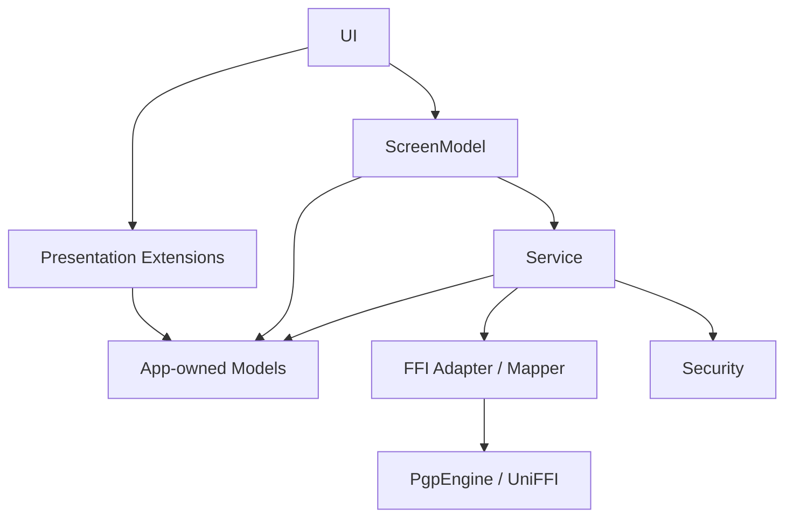

# Architecture Refactor Target

> Status: Active target-state reference.
> Purpose: Define the intended architecture after the refactor at a more concrete level than [Architecture Refactor Goals](ARCHITECTURE_REFACTOR_GOALS.md).
> Audience: Human developers, reviewers, and AI coding tools working on the architecture refactor.
> Related: [Architecture Refactor Goals](ARCHITECTURE_REFACTOR_GOALS.md), [Architecture](ARCHITECTURE.md), [Security](SECURITY.md), [Documentation Governance](DOCUMENTATION_GOVERNANCE.md).
> Current-state note: This document is not a current-state audit, implementation plan, phased work plan, or shipped architecture record.

## Summary

This document describes the target architecture CypherAir should move toward during the architecture refactor. It turns the high-level direction in
[Architecture Refactor Goals](ARCHITECTURE_REFACTOR_GOALS.md) into a concrete reference for dependency boundaries, public contracts, and long-term ownership.

[Architecture](ARCHITECTURE.md) and [Security](SECURITY.md) remain the current-state references for shipped behavior until the refactor is implemented and those documents are updated. This document should be used only as target-state guidance while designing and reviewing refactor changes.

## Dependency Rules

The target dependency shape is:

Dependency rules:

- UI reads ScreenModel state, sends user actions to ScreenModels, and renders app-owned models or presentation values.
- UI does not directly orchestrate service workflows, call Security APIs, call generated UniFFI APIs, or pattern-match generated errors.
- Presentation extensions depend only on app-owned models and presentation frameworks needed to render labels, icons, colors, and accessibility text.
- ScreenModels depend on Services and app-owned models, not on generated UniFFI types or Security internals.
- Services own business workflows and may coordinate Security and FFI adapters, but expose app-owned models and app-owned errors upward.
- Models do not depend on SwiftUI presentation frameworks, Security stores, migration coordinators, or generated UniFFI types.
- FFI adapter / mapper code is the only normal Swift app boundary that calls `PgpEngine` or maps generated records and generated errors.
- Security owns authentication, Keychain, Secure Enclave, ProtectedData, root-secret, relock, and sensitive-buffer lifecycle. Other layers consume Security through service-level workflows or narrow Security protocols.
- App composition may construct concrete Services, Security objects, FFI adapters, stores, and ScreenModels. Composition code wires dependencies; it does not own business policy.
- Tests may use targeted seams or fakes to exercise a layer, but test-only shortcuts should not define production dependencies or leak generated types into production-facing APIs.

## Layer Responsibilities

### UI

UI owns SwiftUI layout, view lifecycle hooks, navigation presentation, importer/exporter modifiers, sheets, alerts, menus, and platform chrome. It should keep business decisions out of view bodies and route meaningful user intent into ScreenModel actions.

UI may format simple view-local values, but shared labels, icons, and colors belong in presentation extensions or dedicated presentation helpers. UI should receive user-displayable state from ScreenModels instead of re-running service decisions.

### Presentation Extensions

Presentation extensions are display helpers only. They may provide:

- localized titles, subtitles, captions, and button labels
- SF Symbol names and semantic colors
- formatted display strings and accessibility labels
- lightweight presentation grouping for app-owned enum or value types

They must not:

- call Services, Security, FFI adapters, stores, or repositories
- perform async workflows or persistence
- normalize crypto or storage errors
- construct generated UniFFI selector or result types
- decide whether a business operation is allowed

### ScreenModel

ScreenModels own user-driven workflow state for a screen or route. They coordinate user intent, transient state, cancellation, progress presentation, importer/exporter state, error presentation, and calls into Services.

ScreenModels expose UI-consumable state and actions. They should accept Services and small injected seams in initializers, but they should not pull dependencies directly from SwiftUI environment values. They should not call `PgpEngine`, Keychain, Secure Enclave, ProtectedData stores, or migration sources directly.

ScreenModel public APIs should speak app-owned models, request models, result models, and `CypherAirError`. Generated FFI types and generated errors such as `PgpError` should not appear in ScreenModel stored properties, action signatures, cancellation checks, or view-facing result state.

### Service

Services own app business workflows. A Service may coordinate:

- app-owned domain models
- FFI adapter calls for OpenPGP operations
- Security workflows for private-key access, authentication, and protected app data
- persistence stores through explicit service-owned boundaries
- temporary artifacts, disk-space checks, progress, cancellation, and rollback policy

Services expose stable app-owned contracts upward. They normalize errors before returning to ScreenModels, keep cryptographic and persistence invariants together with the workflow that requires them, and preserve security boundaries such as two-phase decrypt authentication.

Services should not expose generated UniFFI records, raw generated errors, or legacy compatibility projections as normal runtime API.

### App-Owned Models

Models own CypherAir values, domain records, request/result payloads, error vocabulary, and persisted payload schemas. Suitable model responsibilities include:

- key identity metadata such as `PGPKeyIdentity`
- Contacts domain records such as `ContactIdentity`, `ContactKeyRecord`, summaries, tags, and domain snapshots
- app-level operation result types
- persisted schema payloads and Codable records
- app-owned error cases such as `CypherAirError`

Models should not own:

- `PgpEngine` calls or UniFFI record mapping
- `PgpError -> CypherAirError` conversion
- SwiftUI `Color`, icon, or view-specific display policy
- Keychain, Secure Enclave, ProtectedData store details
- unlock, relock, recovery, or migration coordination state machines
- legacy runtime compatibility projection as a primary data path

If a model needs display metadata, prefer either a presentation extension in `Sources/App/...` or a small app-owned display value prepared by a ScreenModel or Service.

### FFI Adapter / Mapper

The FFI adapter / mapper boundary contains generated UniFFI interaction. It owns:

- all direct `PgpEngine` calls in normal app workflows
- mapping generated records into app-owned models
- mapping app-owned request models into generated selector/input records
- generated-error normalization, including `PgpError -> CypherAirError` and generated cancellation and ignore policy
- off-main execution wrappers around CPU-heavy or file-based engine calls
- generated progress-protocol bridging, cancellation propagation, and result cleanup
- conversion of generated signature, key-info, certificate-selector, decrypt, verify, merge, revocation, and password-message results into app-owned values

Generated types such as `PgpEngine`, `PgpError`, `KeyInfo`, `SignatureStatus`, `SignatureVerificationState`, `UserIdSelectorInput`, `DiscoveredCertificateSelectors`, and generated operation result records should remain inside this boundary or in narrowly scoped migration code while the refactor is underway.

### Security

Security owns hardware-backed and protected-data behavior. It is the authority for:

- Secure Enclave wrapping and unwrapping
- Keychain bundle storage and access-control flags
- authentication mode evaluation and mode switching
- ProtectedData root-secret, domain-key, registry, recovery, relock, and post-unlock lifecycle
- sensitive-buffer zeroization and secret lifetime
- app-session authentication gates and relock participants

Services request security operations through explicit workflows or protocols. UI, presentation extensions, and ScreenModels should not directly coordinate Security internals.

### App Composition

App composition is the exception that knows concrete implementation types. It constructs the dependency graph, registers relock and post-unlock participants, wires stores into services, and installs environment dependencies.

Composition code should avoid embedding business decisions that belong in Services, Security, or ScreenModels. Its job is wiring, not policy ownership.

## FFI Adapter Boundary

The target FFI boundary should make generated UniFFI code replaceable from the perspective of the Swift app surface. App-facing code should not need to know whether a result came from a generated record, a future native Swift adapter, or a test fake.

Target public contract rules:

- Services and ScreenModels return app-owned result types and throw app-owned errors.
- Generated FFI types do not appear in UI-facing configuration, ScreenModel properties, ScreenModel action closures, or app-owned persisted models.
- UI and ScreenModels do not catch or pattern-match generated errors; they consume app-owned error and cancellation results.
- `CypherAirError` remains the shared app error vocabulary, but generated-error mapping belongs to FFI adapter / mapper code.
- Selector-bearing models remain app-owned. The adapter converts them to generated selector inputs only at the FFI call site.
- Signature and verification models remain app-owned. The adapter converts generated signature statuses and detailed result entries into app-owned verification states before Services return.
- Key-info parsing returns app-owned key metadata. Generated `KeyInfo` should not be exposed above the adapter.
- Progress used by generated UniFFI protocols is bridged at the adapter boundary. UI-facing progress state should remain app-owned.
- Tests should prefer app-owned fake adapters over constructing generated records in ScreenModel tests.

The boundary may be implemented as one adapter or as feature-specific adapters. The architectural requirement is containment of generated API knowledge, not a specific file count or directory structure.

## Contacts Target Runtime

The target Contacts runtime is person-centered and domain-snapshot-backed. Normal runtime should use:

- `ContactIdentity` for people or contact identities
- `ContactKeyRecord` for individual public keys and their usage state
- `ContactIdentitySummary`, `ContactKeySummary`, and `ContactRecipientSummary` for UI and recipient selection
- `ContactTag` and `ContactTagSummary` for grouping
- `ContactsDomainSnapshot` as the protected-domain payload shape
- app-owned import, merge, certification, verification, and recipient result models

The legacy flat `Contact` projection is not a primary runtime model in the target architecture. It may remain only behind explicit compatibility boundaries, such as:

- old-install migration input
- legacy repository reads required to build the initial protected-domain snapshot
- temporary compatibility adapters while a call site is being migrated
- focused tests proving migration behavior

Ordinary Contacts flows should not depend on `[Contact]`. This includes recipient selection, signer resolution, contact detail, import confirmation, merge, tags, verification context, certification artifacts, and certificate-signature screens.

Compatibility code should be named and placed so its purpose is obvious. `ContactsCompatibilityMapper`, legacy migration sources, and legacy repositories are adapter boundaries; they should not be mixed into normal protected-domain runtime mutation paths.

## Target Acceptance Markers

The refactor can be considered aligned with this target when these checks hold for normal production code:

- UI route views own rendering and lifecycle only; workflow state and service calls are in ScreenModels.
- Presentation extensions contain display policy only and do not call Services, Security, FFI adapters, stores, or repositories.
- ScreenModel public APIs and stored state do not expose generated UniFFI types.
- Production Views and ScreenModels do not reference `PgpError`.
- Service public APIs return app-owned models and app-owned errors.
- Generated FFI records, generated selectors, generated progress protocols, and `PgpError` mapping are contained in FFI adapter / mapper code.
- Core Models do not import SwiftUI for `Color`, icons, or view-specific display policy.
- Core Models do not depend on Security stores, ProtectedData coordinators, migration sources, or generated UniFFI types.
- `CypherAirError` remains app-owned, while `PgpError -> CypherAirError` conversion is outside Models.
- Normal Contacts runtime does not depend on `[Contact]`; legacy `Contact` appears only in migration or compatibility adapters.
- App composition wires concrete dependencies without becoming the owner of operation policy.
- Sensitive boundaries in `Security.md` remain preserved, including AEAD hard-fail, two-phase decrypt authentication, private-key zeroization, ProtectedData fail-closed behavior, and zero network access.
