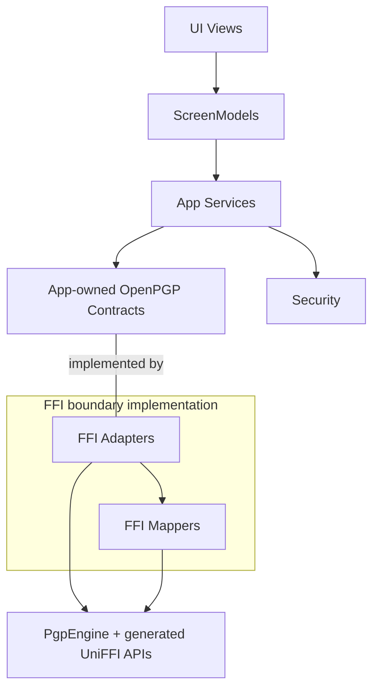

# OpenPGP Contract Boundary Goals

> Status: Draft goals.
> Purpose: Guide post-Phase 5 FFI boundary governance for OpenPGP work.
> Audience: CypherAir maintainers, reviewers, and future implementation planners.

This document is a future-facing goals proposal. Current shipped architecture
continues to live in [Architecture](ARCHITECTURE.md), security behavior in
[Security](SECURITY.md), validation guidance in [Testing](TESTING.md), and the
point-in-time leak inventory in
[FFI Boundary Leak Audit](FFI_BOUNDARY_LEAK_AUDIT.md).

The goal for the next governance stage is to introduce app-owned OpenPGP
Contracts as the stable boundary between App Services and the FFI boundary
implementation. Those Contracts should let Services express OpenPGP capability
needs in app vocabulary while keeping generated UniFFI vocabulary inside the
adapter / mapper implementation layer.

## Intended Boundary Shape

The contract-to-adapter association represents implementation conformance. App
Services consume the app-owned Contracts. FFI Adapters provide the production
implementations, organize mapper usage, and call `PgpEngine` plus generated
UniFFI APIs.

## Goals

Establish app-owned OpenPGP Contracts for the capability families now reached
through concrete FFI adapters: message operations, key operations, certificate
operations, contact import, and self-test operations. The Contracts should
carry operation semantics, app-owned request and result vocabulary, progress and
cancellation expectations, and the app-owned error boundary needed by Services.

Keep FFI Adapters as the production bridge from those Contracts to the generated
OpenPGP surface. Adapters should own engine calls, generated progress bridges,
off-main crypto and file execution responsibilities, and the coordination of
mapper calls.

Keep FFI Mappers inside the FFI boundary implementation. Mappers should
translate generated records, generated errors, status enums, selector inputs,
metadata values, and detailed result values into app-owned vocabulary before
data returns to ordinary Services, ScreenModels, or Views.

Keep Security coordination at the App Service level. Secure Enclave, Keychain,
authentication modes, ProtectedData access, relock, recovery, and
sensitive-buffer lifecycle remain governed by the security architecture while
OpenPGP Contracts describe the crypto capabilities Services consume.

Shrink composition ownership of generated OpenPGP objects. Composition should
build the dependency graph and isolate production and tutorial wiring while
moving engine ownership into the adapter graph.

## Remaining Leaks To Govern

The detailed inventory lives in
[FFI Boundary Leak Audit](FFI_BOUNDARY_LEAK_AUDIT.md). The next governance stage
should track these verified categories and use the audit for evidence and
examples:

- composition roots and UI-test preload paths that still expose or call
  `PgpEngine`
- ordinary Services that depend on concrete FFI adapter classes
- adapter-local `PGP*` helper, context, and result values used by ordinary
  Services
- service and ScreenModel tests that mix generated engine, generated error, or
  generated result details into service-level setup or assertions
- remaining Settings-adjacent and status-display surfaces that still need the
  same View / ScreenModel separation applied to the main OpenPGP flows

Each category should be governed by a small app-owned boundary before adding
new process or test expectations. Architecture review and behavior tests should
track hard generated UniFFI leaks above the adapter boundary; follow-up
guardrails should come after the migrated surface has a stable app-owned
Contract or mapper boundary.

## Layer Responsibility Addendum

[Architecture Refactor Goals](ARCHITECTURE_REFACTOR_GOALS.md) defines the
general layer direction. [Architecture Refactor Reference](ARCHITECTURE_REFACTOR_TARGET.md)
contains the more concrete architecture reference. General UI, ScreenModel,
Service, Security, and composition responsibilities remain governed by those
documents and the current-state architecture docs. This section adds only the
OpenPGP boundary goals below.

App Services should consume OpenPGP Contracts as capability boundaries.

OpenPGP Contracts define the app-owned capability surface consumed by Services:
operation semantics, request and result vocabulary, payload classes, progress
and cancellation expectations, and the error boundary.

FFI Adapters implement the OpenPGP Contracts for production, bridge generated
progress protocols, coordinate mapper use, and call `PgpEngine` plus generated
UniFFI APIs.

FFI Mappers translate generated OpenPGP values into app-owned vocabulary at the
boundary. Mapper responsibilities include generated `PgpError` normalization,
generated result and status mapping, selector input mapping, metadata mapping,
and detailed result mapping.

Composition constructs dependency graphs for production and tutorial surfaces.
Its long-term role is graph construction and wiring isolation, with generated
engine ownership concentrated inside the adapter graph.

## Follow-Up Document Expectations

Later documents can define concrete Contract families, migration sequence,
adapter refactoring order, test cleanup, and review expectations. Those
documents can also decide where durable app-owned request, result, and context
values should live.

This goals document leaves protocol names, file paths, method signatures, PR
breakdown, validation commands, and Rust / UniFFI API changes to those later
documents.
