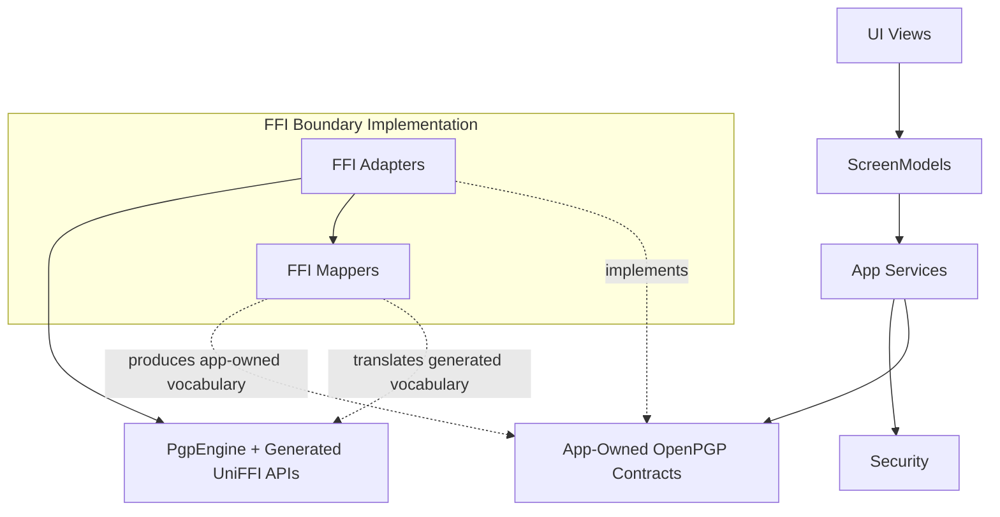

# OpenPGP Contract Boundary Goals

> Status: Draft goals proposal.
> Purpose: Record the high-level goals for continued FFI boundary governance after Phase 5 of the architecture refactor.
> Audience: CypherAir maintainers, reviewers, and coding agents planning follow-up OpenPGP boundary work.
> Related: [FFI Boundary Leak Audit](FFI_BOUNDARY_LEAK_AUDIT.md), [Architecture](ARCHITECTURE.md), [Architecture Refactor Target](ARCHITECTURE_REFACTOR_TARGET.md), [Security](SECURITY.md), [Testing](TESTING.md), [Coding Conventions](CONVENTIONS.md), [Documentation Governance](DOCUMENTATION_GOVERNANCE.md).
> Current-state note: This document describes future architecture goals. It is not a current shipped-behavior record or implementation reference.

## Summary

After Phase 5 narrows security and app-composition ownership, the next OpenPGP
boundary governance stage should introduce app-owned OpenPGP contracts between
App Services and the FFI boundary implementation.

The intended dependency shape is:

App Services depend on app-owned OpenPGP contracts. FFI adapters implement
those contracts and call `PgpEngine` through generated UniFFI APIs. FFI mappers
remain inside the FFI boundary implementation and translate generated
vocabulary into app-owned values before results or failures reach Services.

This design keeps OpenPGP capability ownership stable for the Swift app while
allowing the concrete FFI implementation to evolve behind the contract boundary.

## Boundary Goals

- Establish app-owned OpenPGP contracts as the stable capability surface that
  App Services consume for message, key, certificate, contact-import / QR, and
  diagnostic OpenPGP work.
- Keep UI Views connected to ScreenModels. Views own rendering, navigation
  presentation, platform chrome, lifecycle hooks, sheets, alerts, import/export
  modifiers, and user-action forwarding.
- Keep ScreenModels responsible for screen-level workflow state, async task
  state, cancellation, progress presentation, transient errors, and calls into
  App Services.
- Keep App Services responsible for business workflows, Security coordination,
  Contacts and key policy, temporary artifact handling, rollback behavior,
  app-owned result semantics, and consumption of OpenPGP contracts.
- Keep the FFI boundary implementation responsible for contract implementation,
  engine calls, mapper use, generated progress bridging, generated-error
  normalization, and generated-to-app-owned result translation.
- Keep `PgpEngine`, generated UniFFI APIs, generated records, generated errors,
  and generated progress protocols inside the FFI boundary implementation for
  normal production workflows.

## Remaining Leak Types To Govern

The remaining leak categories are narrower than the original direct-engine
boundary problem and should be treated as boundary-governance debt:

- App composition still exposes generated engine ownership in production and
  tutorial wiring, and a UI-test preload path still performs generated engine
  work directly.
- Ordinary Services still depend on concrete FFI adapter classes for OpenPGP
  operations; the intended boundary is app-owned OpenPGP contracts.
- Adapter-local helper, context, and result values still cross into ordinary
  Services, which keeps FFI boundary vocabulary visible in service workflow
  code.
- Mapper responsibility is mostly concentrated inside the FFI boundary today,
  and future contract design should preserve that containment for generated
  mappers and adapter-local mapping vocabulary.
- Some service-level and ScreenModel tests still use generated engine, error,
  or result details where app-owned fakes would better express service-layer
  intent.
- Phase 4 improved the main workflow-heavy route and ScreenModel boundaries;
  remaining status views and Settings-adjacent surfaces still need later
  governance after Phase 5 establishes narrower service workflow boundaries.

## Layer Responsibilities

### UI Views

UI Views render state and forward user intent. They own layout, navigation
presentation, platform chrome, lifecycle hooks, import/export modifiers, sheets,
alerts, and local presentation affordances.

Views should receive workflow-ready state from ScreenModels and route actions
through ScreenModel methods. OpenPGP operations, Security coordination, FFI
adapter calls, generated error handling, and mapper use belong below the view
layer.

### ScreenModels

ScreenModels own route-specific workflow state. They prepare UI-consumable
state, coordinate async user actions, handle cancellation and progress
presentation, manage transient errors, and call App Services.

ScreenModel APIs should use app-owned request, result, and error vocabulary.
Their public state and action surfaces stay aligned with Services and app-owned
values.

### App Services

App Services own product workflows. They coordinate Security, Contacts, key
state, temporary artifacts, disk and memory policy where relevant, rollback,
operation ordering, and app-owned error semantics.

For OpenPGP work, Services should consume app-owned OpenPGP contracts. Services
should decide business policy and input preparation, then receive app-owned
results and errors from the contract implementation. This keeps Services stable
when the concrete FFI implementation or generated UniFFI surface changes.

### App-Owned OpenPGP Contracts

OpenPGP contracts are the stable Swift capability boundary consumed by App
Services. They should describe operation semantics using app-owned request,
result, context, progress, cancellation, and error vocabulary.

The contracts should make payload classes and security-relevant expectations
clear at a high level: binary versus armored payload behavior, signature and
verification result meaning, private-key material lifetime expectations,
generated-cancellation normalization, and app-owned failure categories.

Service APIs should carry app-owned vocabulary while generated records,
generated selectors, generated errors, generated progress protocols, and
adapter-local mapper vocabulary stay within the FFI boundary implementation.

### FFI Adapters

FFI adapters implement the app-owned OpenPGP contracts. They own the concrete
connection to `PgpEngine`, call generated UniFFI APIs, invoke mappers, bridge
generated progress callbacks, and isolate off-main crypto or file operations.

Adapters should stay narrow enough that each contract capability can be tested
with app-owned fakes at the Service layer and with generated-engine integration
tests at the FFI layer.

### FFI Mappers

FFI mappers are internal collaborators of the FFI boundary implementation. They
normalize generated errors, translate generated status and result records,
convert app-owned selector and profile values at the call site, and produce
app-owned metadata and detailed verification values.

Mapper use should remain a boundary implementation detail. App Services,
ScreenModels, and Views should receive app-owned values after mapper work has
completed.

### Security

Security owns Secure Enclave wrapping and unwrapping, Keychain access-control
behavior, authentication modes, ProtectedData, relock, recovery, app-session
authorization gates, and sensitive-buffer lifecycle.

OpenPGP contract governance must preserve the security invariants documented in
the current security model, including two-phase decrypt authentication, AEAD
hard-fail behavior, private-key zeroization, passphrase lifetime mitigations,
ProtectedData fail-closed behavior, and zero network access.

### Composition

Composition constructs the dependency graph for production, UI tests, and the
guided tutorial sandbox. It wires concrete Security objects, stores, Services,
OpenPGP contract implementations, and ScreenModels where appropriate.

The intended state keeps generated engine ownership private to the FFI boundary
implementation graph. Composition may create that graph, and App-facing wiring
should pass Services or app-owned contract capabilities.

## Follow-Up Document Expectations

Later target and implementation references may define concrete contract
families, migration order, validation strategy, and generated-surface details.
This document intentionally stays at the high-level design-goal layer so those
later documents can make implementation decisions against a stable
architectural direction.
